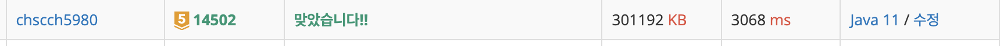

# [JAVA] BOJ - 연구소(14502)


## 1. 문제

- https://www.acmicpc.net/problem/14502


## 2. 접근

1. 벽 세우기
   - 재귀적으로 호출하면서 벽을 세웠을 때와 벽을 세우지 않았을 때를 다 따져본다.
   - 브루트 포스
2. 바이러스 퍼트리기
   - 그래프 탐색을 통해 연결 되어 있는 통로들을 바이러스로 채운다.
   - 여기서는 bfs 사용
   - 각 경우에 대해 바이러스 확산을 표시하기 때문에 맵을 새로 복사해서 활용한다.
3. 안전 영역 확인하기
   - 바이러스 확산이 된 후 맵을 순회하면서 안전 영역이 있는지 확인한다.


## 3. 풀이

```java
package study01;

import java.util.ArrayList;
import java.util.LinkedList;
import java.util.Queue;
import java.util.Scanner;

public class BOJ_14502 {
	static int N, M;
	static int[][] map;	// 맵
	static int[][] tmpMap;	// 복사해서 바이러스 퍼트릴 맵
	static boolean[][] visited;
	static int[][] pos_arr = {{-1,0},{1,0},{0,-1},{0,1}};	// 상,하,좌,우
	static Queue<int[]> queue = new LinkedList<>();
	static ArrayList<int[]> virus_pos_list = new ArrayList<>();	// 초기 바이러스 위치
	static int result = Integer.MIN_VALUE;
	public static void main(String[] args) {
		Scanner scan = new Scanner(System.in);
		N = scan.nextInt();
		M = scan.nextInt();
		map = new int[N][M];
		visited = new boolean[N][M];
		for (int i = 0; i < N; i++) {
			for (int j = 0; j < M; j++) {
				map[i][j] = scan.nextInt();
				// 입력 받을 때 바이러스 위치 저장
				if(map[i][j] == 2) virus_pos_list.add(new int[] {i, j});
			}
		}
		// 벽 세우기
		installWalls(0);
		System.out.println(result);
	}
	
	static void installWalls(int wall_count) {
		if(wall_count == 3) {
			copyMap();		// 맵 복사
			spread_virus();		// 바이러스 퍼트리기
			get_safety_zone();	// 안전영역 찾기
			return;
		}
		for (int i = 0; i < N; i++) {
			for (int j = 0; j < M; j++) {
				if(map[i][j] == 0) {
					map[i][j] = 1;
					installWalls(wall_count+1);
					map[i][j] = 0;
				}
			}
		}
	}
	
	static void copyMap() {
		visited = new boolean[N][M];
		tmpMap = new int[N][M];
		for (int i = 0; i < N; i++) tmpMap[i] = map[i].clone();
	}
	
	static void spread_virus() {
		queue.clear();
		for (int[] virus : virus_pos_list) {
			queue.add(new int[] {virus[0], virus[1]});
		}
		while(!queue.isEmpty()) {
			int[] pos = queue.poll();
			int r = pos[0];
			int c = pos[1];
			visited[r][c] = true;
			tmpMap[r][c] = 2;
			for (int i = 0; i < pos_arr.length; i++) {
				int nr = r + pos_arr[i][0];
				int nc = c + pos_arr[i][1];
				if(nr>=0 && nr<N && nc>=0 && nc<M && tmpMap[nr][nc] == 0 && !visited[nr][nc]) {
					queue.add(new int[] {nr,nc});
				}
			}
		}
	}
	
	static void get_safety_zone() {
		int safe_count = 0;
		for (int i = 0; i < N; i++) {
			for (int j = 0; j < M; j++) {
				if(tmpMap[i][j] == 0) {
					safe_count++;
				}
			}
		}
		result = Math.max(result, safe_count);
	}
	
}
```



- 시간이랑 메모리를 너무 많이 잡아먹는데 그 원인이 무엇인지 찾고 있다.ㅠ


## 4. 정리

- BFS와 DFS로만 푸는 문제는 쉬운 편이고 이런식으로 완전탐색이나 다른 유형들과 섞여서 나오는 게 대부분인 것 같다.
- 처음에 벽을 세우고 안세우고를 구현하는 게 어려웠지만 재귀라는 기술을 사용하면 쉽게 풀 수 있다는 것을 느꼈다.