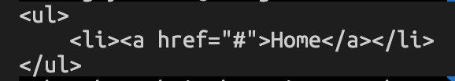

# Javascript-06 데이터 타입

- 자바스크립트(ES6)는 7개의 데이터 타입을 제공한다. 7개의 데이터 타입은 원시 타입(primitive type)과 객체 타입(object/reference type)으로 분류할 수 있다.

|   구분   |      데이터타입      |                        설명                         |
| :------: | :------------------: | :-------------------------------------------------: |
| 원시타입 |  숫자(number) 타입   | 숫자, 정수와 실수 구분 없이 하나의 숫자 타입만 존재 |
|          | 문자열(string) 타입  |                       문자열                        |
|          | 불리언(boolean) 타입 |            논리적 참(true)과 거짓(false)            |
|          |    undefined 타입    |  var 키워드로 선언된 변수에 암묵적으로 할당되는 값  |
|          |      null 타입       |  값이 없다는 것을 의도적으로 명시할 때 사용하는 값  |
|          |  심벌(symbol) 타입   |              ES6에서 추가된 7번째 타입              |
| 객체타입 |          -           |                 객체, 함수, 배열 등                 |

- 숫자 타입의 값 1과 문자열 타입의 값 '1'은 값을 생성한 목적과 용도가 다르다.
- 또한 확보해야 할 메모리 공간의 크기도 다르고 메모리에 저장되는 2진수도 다르며 읽어 들여 해석하는 방식도 다르다.


## 1. 숫자 타입

- 자바스크립트는 하나의 숫자 타입만 존재한다.
- 숫자 타입의 값은 배정밀도 64비트 부동소수점 형식을 따른다. 즉, 모든 수를 실수로 처리하며, 정수만 표현하기 위한 데이터 타입이 별도로 존재하지 않는다.
- 정수로 표현된다 해도 사실은 실수값이다. 따라서 정수로 표시되는 수끼리 나누더라도 실수가 나올 수 있다.

```javascript
// 숫자 타입은 모두 실수로 처리된다ㅏ.
console.log(1 === 1.0);	// true
console.log(4 / 2); // 2
console.log(3 / 2); // 1.5
```


## 2. 문자열 타입

- 문자열(string) 타입은 텍스트 데이터를 나타내는 데 사용한다. 문자열은 0개 이상의 16비트 유니코드 문자(UTF-16)의 집합으로 전 세계 대부분의 문자를 표현할 수 있다.
- 다른 타입과 달리 문자열을 따옴표로 감싸는 이유는 키워드나 식별자 같은 토큰과 구분하기 위해서이다. 만약 문자열을 따옴표로 감싸지 않으면 자바스크립트 엔진은 키워드나 식별자 같은 토큰으로 인식한다.

```javascript
// 따옴표로 감싸지 않은 hello를 식별자로 인식한다.
var string = hello;	// referenceError: hello is not defined

```

- C는 문자열 타입을 제공하지 않고 문자의 배열로 문자열을 표현하고, 자바는 문자열을 객체로 표현한다.
- 그러나 자바스크립트의 문자열은 원시 타입이며, 변경불가능한 값(immutable value)이다.


## 3. 템플릿 리터럴

- 멀티라인 문자열(multi-line string), 표현식 삽입(expression interpolation), 태그드 템플릿(tagged template) 등 편리한 문자열 처리 기능을 제공한다.
- 템플릿 리터럴은 백틱(``)을 사용해 표현한다.

```javascript
var template = `Template literal`;
console.log(template);	// Template literal
```

### 3-1) 멀티라인 문자열

- 일반 문자열 내에서는 줄바꿈(개행)이 허용되지 않는다.

```javascript
var str = 'Hello
world.';
// SyntaxError: Invalid or unexpected token
```

| 이스케이프 시퀀스 |                             의미                             |
| :---------------: | :----------------------------------------------------------: |
|        \0         |                             Null                             |
|        \b         |                          백스페이스                          |
|        \f         | 폼 피드(Form Feed): 프린터로 출력한 경우 다음 페이지의 시작 지점으로 이동하다. |
|        \n         |            개행(LF, Line Feed): 다음 행으로 이동             |
|        \r         |       개행(CR, Carriage Return): 커서를 처음으로 이동        |
|        \t         |                           탭(수평)                           |
|        \v         |                           탭(수직)                           |
|      \uXXXX       |     유니코드, 예를 들어 '\u0041'은 'A', '\uD55C'는 '한'      |
|        \\'        |                         작은 따옴표                          |
|       \\''        |                          큰 따옴표                           |
|        \\\        |                           백슬래시                           |

- 일반 문자열과 달리 템플릿 리터럴 내에서는 이스케이프 시퀀스를 사용하지 않고도 줄바꿈이 허용되며, 모든 공백도 있는 그대로 적용된다.

```javascript
var template = `<ul>
    <li><a href="#">Home</a></li>
</ul>`;

console.log(template);
```



### 3-2) 표현식 삽입

- 문자열은 문자열 연산자(+)를 사용해 연결할 수 있다. + 연산자는 피연산자 중 하나 이상이 문자열인 경우 문자열 연결 연산자로 동작한다. 그 외의 경우는 덧셈 연산자로 동작한다.

```javascript
var first = 'chichi';
var last = 'choi';

// ES5: 문자열 연결
console.log('My name is ' + first + ' ' + last + '.'); // My name is chichi choi.
```

- 템플릿 리터럴 내에서는 표현식 삽입(expression interpolation)을 통해 간단히 문자열을 삽입할 수 있다.
- 표현식을 삽입하려면 ${ } 으로 표현식을 감싼다. 이때 표현식의 평가 결과가 문자열이 아니더라도 문자열로 타입이 강제로 변환되어 삽입된다.

```javascript
var first = 'chichi';
var last = 'choi';

// ES6: 표현식 삽입
console.log(`My name is ${first} ${last}.`); // My name is chichi choi.
```

```javascript
console.log(`1 + 2 = ${1 + 2}`);	// 1 + 2 = 3
```


## 4. 불리언 타입

- 논리적 참, 거짓을 나타내는 true와 false뿐이다.


## 5. undefined 타입

- var 키워드로 선언한 변수는 암묵적으로 undefined로 초기화된다. 변수 선언에 의해 확보된 메모리 공간을 처음 할당이 이뤄질 때까지 빈 상태(대부분 비어있지 않고 쓰레기 값이 들어있다.)로 내버려두지 않고 자바스크립트 엔진이 undefined로 초기화된다.
- 따라서 변수를 선언한 이후 값을 할당하지 않은 변수를 참조하면 undefined가 반환된다.
- 변수를 참조했을 때 undefined가 반환된다면 참조한 변수가 선언 이후 값이 할당한 적이 없는, 즉 초기화되지 않은 변수라는 것을 간파할 수 있다.
- 개발자가 변수에 값이 없다는 것을 명시하고 싶을 때는 undefined를 할당하는 것이 아니라 null을 할당한다.


## 6. null 타입

- 자바스크립트는 대소문자를 구별하므로 null은 Null, NULL 등과 다르다.
- 프로그래밍 언어에서 null은 변수에 값이 없다는 것을 의도적으로 명시할 때 사용한다. 변수에 null을 할당하는 것은 변수가 이전에 참조하던 값을 더 이상 참조하지 않겠다는 의미다.
- 이는 이전에 할당되어 있던 값에 대한 참조를 명시적으로 제거하는 것을 의미하며, 자바스크립트 엔진은 누구도 참조하지 않는 메모리 공간에 대해 가비지 콜렌션을 수행할 것이다.
- 함수가 유효한 값을 반환할 수 없는 경우 명시적으로 null을 반환하기도 한다.


## 7. 심벌 타입

- 심벌(symbol)은 ES6에서 추가된 7번째 타입으로, 변경 불가능한 원시 타입의 값이다. 심벌 값은 다른 값과 중복되지 않는 유일무이한 값이다.
- 따라서 주로 이름이 충돌할 위험이 없는 객체의 유일한 프로퍼티 키를 만들기 위해 사용한다.
- 심벌 이외의 원시 값은 리터럴을 통해 생성하지만 심벌은 Symbol 함수를 호출해 생성한다. 이때 생선된 심벌 값은 외부에 노출되지 않으며, 다른 값과 절대 중복되지 않는 유일무이한 값이다.

```javascript
// 심벌 값 생성
var key = Symbol('key');
console.log(typeof key);	// symbol

// 객체 생성
var obj = {};

// 이름이 충돌할 위험이 없는 유일무이한 값인 심벌을 프로퍼티 키로 사용한다.
obj[key] = 'value';
console.log(obj[key]);	// value
```


## 8. 객체 타입

- 원시 타입과 객체 타입은 근본적으로 다르다는 의미이다. 11장에서 다시 알아본다.


## 9. 데이터 타입의 필요성

- 값을 저장할 때 확보해야 하는 메모리 공간의 크기를 결정하기 위해
- 값을 참조할 때 한번에 읽어들여야 할 메모리 공간의 크기를 결정하기 위해
- 메모리에서 읽어 들인 2진수를 어떻게 해석할지 결정하기 위해


## 10. 동적 타이핑

### 10-1) 동적 타입 언어와 정적 타입 언어

- C나 자바 같은 정적 타입(static/strong type) 언어는 변수를 선언할 때 변수에 할당할 수 있는 값의 종류, 즉 데이터 타입을 사전에 선언해야 한다. 이를 명시적 타입 선언(explicit type declaration) 이라 한다.
- 정적 타입 언어는 변수의 타입을 변경할 수 없으며, 변수에 선언한 타입에 맞는 값만 할당할 수 있다.
- 정적 타입 언어는 컴파일 시점에 타입 체크(선언한 데이터 타입에 맞는 값을 할당했는지 검사하는 처리)를 수행한다. 만약 타입 체크를 통과하지 못했다면 에러를 발생시키고 프로그램의 실행 자체를 막는다.
- 자바스크립트는 정적 타입 언어와 다르게 변수를 선언할 때 타입을 선언하지 않는다. 어떠한 데이터 타입의 값이라도 자유롭게 할당할 수 있다.

```javascript
var foo;
console.log(typeof foo);	// undefined

foo = 3;
console.log(typeof foo);	// number

foo = 'Hello';	
console.log(typeof foo);	// string

foo = true;	
console.log(typeof foo);	// boolean

foo = null;	
console.log(typeof foo);	// object

foo = Symbol();	// 심벌
console.log(typeof foo);	// symbol

foo = {};	// 객체
console.log(typeof foo); 	// object

foo = []; // 배열
console.log(typeof foo);	// object

foo = function () {};	// 함수
console.log(typeof foo);	// function
```

- 자바스크립트의 변수는 선언이 아닌 할당에 의해 타입이 결정(타입 추론 type inference)된다. 그리고 재할당에 의해 변수의 타입은 언제든지 동적으로 변할 수 있다. 이러한 특징을 동적 타이핑(dynamic typing)이라 한다.


### 10-2) 동적 타입 언어와 변수

- 동적 타입 언어 또한 구조적인 단점이 있다.
- 변수 값은 언제든지 변경될 수 있기 때문에 복잡한 프로그램에서는 변화하는 변수 값을 추적하기 어렵다.
- 따라서 동적 타입 언어의 변수는 값을 확인하기 전에는 타입을 확신할 수 없다.
- 또한 자바스크립트는 개발자의 의도와는 상관없이 자바스크립트 엔진에 의해 암묵적으로 타입이 자동으로 변환되기도 한다.
- 동적 타입 언어는 유연성(flexibility)은 높지만 신뢰성(reliability)은 떨어진다.