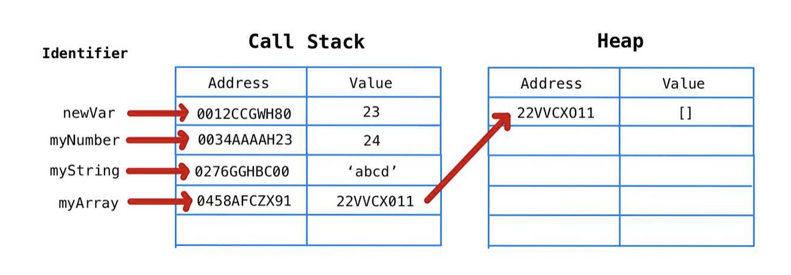

# Immutability

- **불변성**: 값이나 상태를 변경할 수 없는 값을 의미

  - 상태를 변경하는데, 상태를 변경하지 않으면서 원하는 상태를 바꾼다는게 말이 어렵다...

  - 필요한 값을 변형해서 사용하고 싶다면 어떤 값의 사본을 만들어서 사용해야 한다.


## 💡1. 찾아보게 된 계기

- redux 예제를 공부하면서 느낀건데 다음과 같이 상태값을 수정하는데 굉장히 복잡하다.(같은 기능을 동작하는 코드이고 리팩토링하는 과정을 보여준다.)
- 리액트와 자바스크립트를 처음 사용해보는 사람으로써 조금은 번거롭다고 느낀다.
- 왜 이렇게 상태값을 복사해서 넘겨줘야 하는지 찾아보자!

```react
// 리듀서
function todos(state = initialState, action) {
    switch (action.type) {
        case CHANGE_INPUT:
            return {
                ...state,
                input: action.input
            };
        case INSERT:
            return {
                ...state,
                todos: state.todos.concat(action.todo)
            };
        case TOGGLE:
            return {
                ...state,
                todos: state.todos.map(todo =>
                    todo.id === action.id ? { ...todo, done: !todo.done } : todo
                )
            };
        case REMOVE:
            return {
                ...state,
                todos: state.todos.filter(todo => todo.id !== action.id )
            };
        default:
            return state;
    }
}
```

```react
// 리듀서
// redux-actions 라이브러리 사용
const todos = handleActions({
    [INSERT]: (state,action) => ({...state, todos: state.todos.concat(action.payload)}),
    [CHANGE_INPUT]: (state,action) => ({...state, input: action.payload}),
    [REMOVE]: (state,action) => ({...state, todos: state.todos.filter((todo) => (todo.id !== action.payload))}),
    [TOGGLE]: (state,{payload: id}) => ({...state, todos: state.todos.map((todo) => todo.id === id ? {...todo,done: !todo.done} : todo)})
}, initialState)
```

```react
// 리듀서
// immer 사용
const todos = handleActions(
    {
        [CHANGE_INPUT]: (state, { payload: input }) => 
            produce(state, draft => {
                draft.input = input;
            }),
        [INSERT]: (state, { payload: todo }) => 
            produce(state, draft => {
                draft.todos.push(todo);
            }),
        [TOGGLE]: (state, { payload: id }) => 
            produce(state, draft => {
                const todo = draft.todos.find(todo => todo.id === id);
                todo.done = !todo.done;
            }),
        [REMOVE]: (state, { payload: id }) =>
            produce(state, draft => {
                const index = draft.todos.findIndex(todo => todo.id === id);
                draft.todos.splice(index, 1);
            })
    },
    initialState,
);
```


## 💡2. React의 기본 속성

- 리액트는 **얕은 비교**를 통해 새로운 값인지 아닌지를 판단한 후 새로운 값인 경우 리렌더링을 한다.
- **얕은 비교**란 객체, 배열, 함수와 같은 참조 타입들을 실제 내부 값까지 비교하지 않고 <u>동일 참조(동일한 메모리 값을 사용하는지)를 비교한다.</u>
- 다음 시나리오를 보면서 왜 리액트에서 state 값을 직접 변경하면 안되는지 느껴보자.
  1. 컴포넌트 내부에 배열 타입의 state 값을 리렌더링 해야 하는 상황이 있다고 가정한다.
  2. 이때, `state.push('a')`을 통해 state 배열에 직접 접근하여 요소를 추가한다.
  3. 우리는 push 전과 다른 값이라고 생각하지만, 리액트는 state라는 값은 **새로운 참조값이 아니기 때문에** 이전과 같은 값이라고 인식하고 리렌더링 하지 않는다.

- 위와 같은 이유로 새로운 객체 or 배열을 만들어 새로운 참조값을 만들고, 리액트에게 이 값은 이전과 다른 참조값임을 알려야 한다.


### 2-1) 객체(배열) 복사 예제



```javascript
const user = { name: 'chichi', age: 30 } 
const copyUser = user; // 배열의 복사가 아니라 같은 참조 값을 가짐
user.age += 1; 
console.log('user: ', user);
console.log('copyUser: ', copyUser);

/* 
user: { name: 'chichi', age: 31 } 
copyUser: { name: 'chichi', age: 31 } 
*/ 
```

```javascript
const arr = ['b', 'c', 'd'];
const copyArr = arr;
arr.push('a');
console.log('arr: ', arr);
console.log('copyArr: ', copyArr);

/* 
arr: ["b", "c", "d", "a"]
copyArr:["b", "c", "d", "a"]
*/ 
```


## 💡3. React에서 불변성을 지켜야 하는 이유

1. side effect 방지 및 프로그래밍 구조의 단순성
   - 변수가 수정 불가능하면 함수에서 side effect가 발생할 확률이 낮아진다. => 프로그램의 복잡도가 낮아진다.
   - 수정 불가능한 변수는 thread-safe 하므로 동기화 문제에서 자유롭다.(두 개의 쓰레드가 동시에 같은 변수를 수정하려고 하는 경우)
2. 변경이 일어난 객체의 주소만 비교함으로써 React에서 최적화가 가능하다.
   - 객체 내부 요소를 하나하나 비교하는 방법은 비효율적이다.
   - 얕은 비교를 사용한다.


## 💡4. 불변성 지키면서 state 바꾸기

### - 배열에 추가

```react
setUsers(state.array.concat(user));
```

### - 배열에서 삭제

```react
const onRemove = id => {
  // user.id 가 id 인 것을 제거
  setUsers(users.filter(user => user.id !== id));
};
```

### - 배열에서 수정

```react
const onToggle = id => {
  setUsers(
    users.map(user =>
      user.id === id ? { ...user, active: !user.active } : user
    )
  );
};
```

---

### - 객체에서 추가

```react
setState(state => {...state, key: value})
```

### - 객체에서 삭제

```react
setState(state => {..._.omit(state, 'deleteKey')})
```

### - 객체에서 수정

```react
setState(state => {...state, key: newValue})
```

---

### - immer

- [공식 문서](https://immerjs.github.io/immer/)
- `produce` 함수만 기억하면 된다.
- 두 개의 파라미터를 받는다.
  - 첫번째 파라미터는 수정하고 싶은 객체(배열)
  - 두번쨰 파라미터는 할당된 객체(배열)를 바꾸는 함수

```react
import produce from "immer";

const baseState = [
  {
    todo: "javascript 공부",
    done: true
  },
  {
    todo: "Algorithm 공부",
    done: false
  }
];

const nextState = produce(baseState, draftState => {
  draftState.push({ todo: "CS 공부" });
  draftState[1].done = true;
});
```

### - redux에서 immer 쓰기

- immer 쓰기 전 reduce 코드

```react
const initialState = [{ name: "chichi", address: { city: "seoul" } }];

export default function auth(state = initialState, action) {
  switch (action.type) {
    case SET_INFO:
      return {
        ...state,
        name: "sh",
        address: {
          ...state.address,
          city: "busan"
        }
      };
    default:
      return state;
  }
}
```

- immer 쓴 reduce 코드

```react
const initialState = [{ name: "chichi", address: { city: "seoul" } }];

export default function auth(state = initialState, action) {
  produce(state, draft => {
    switch (action.type) {
      case SET_INFO:
        draft[0].name = action.data.name;
        draft[0].address.city = action.data.city;
        break;
      case ADD_INFO:
        draft.push({ name: "sh", address: { city: "busan" } });
      default:
        return draft;
    }
  });
}
```


## 💡5. 정리

- 불변성이란 메모리 영역 값을 변경할 수 없는 것이다.
- 불변성 규칙을 지켜줌으로써 side effect를 방지하고 프로그래밍 구조를 단순화한다. 또한 효율적인 상태 업데이트를 한다.
- 불변성을 가진 원시타입과 달리 참조타입은 의도적으로 불변성을 지켜주어야 한다.


---

참조

- https://junwoo45.github.io/2019-11-04-memory_model/
- https://kyounghwan01.github.io/blog/React/immer-js/#%E1%84%87%E1%85%AE%E1%86%AF%E1%84%87%E1%85%A7%E1%86%AB%E1%84%89%E1%85%A5%E1%86%BC-%E1%84%8C%E1%85%B5%E1%84%8F%E1%85%B5%E1%84%86%E1%85%A7%E1%86%AB%E1%84%89%E1%85%A5-state-%E1%84%87%E1%85%A1%E1%84%81%E1%85%AE%E1%84%80%E1%85%B5

