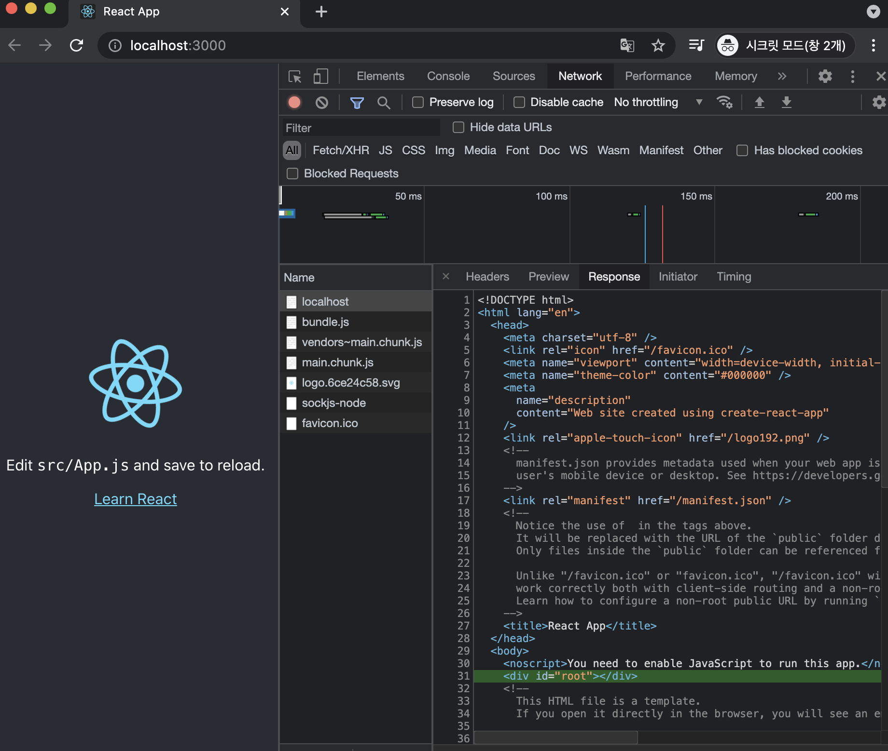

# ReactJS-20 서버 사이드 렌더링

## 🔥1. 서버 사이드 렌더링의 이해

- 서버 사이드 렌더링은 UI를 서버에서 렌더링하는 것을 의미
- 클라이언트 사이드 렌더링은 UI 렌더링을 브라우저에서 모두 처리하는 것을 의미, 자바스크립트를 실행해야 우리가 만든 화면이 사용자에게 보여진다.

```bash
$ yarn create react-app ssr-recipe
$ cd ssr-recipe
$ yarn start
```



- 애플리케이션을 실행시키고 크롬 개발자 도구의 Network 탭을 살펴보자.
  - 맨위에 있는 localhost를 선택하고 Response를 보면 root 엘리먼트가 비어 있는 것을 확인할 수 있다.
  - 즉, 이 페이지는 처음에 빈 페이지라는 의미이다. 그 이후에 자바스크립트가 실행되고 리액트 컴포넌트가 렌더링 되면서 우리에게 보이는 것이다.
- 서버 사이드 렌더링을 구현하면 사용자가 웹 서비스에 방문했을 때 서버 쪽에서 초기 렌더링을 대신해준다. 그리고 사용자가 html을 전달받을 때 그 내부에 렌더링 된 결과물이 보인다.


### 1-1) 서버 사이드 렌더링의 장점

1. 구글, 네이버, 다음 등의 검색 엔진이 우리가 만든 웹 애플리케이션의 페이지를 원할하게 수집할 수 있다.
   - 리액트로 만든 SPA는 검색 엔진 크롤링 봇처럼 자바스크립트가 실행되지 않는 환경에서 페이지가 제대로 나타나지 않는다.
   - 그래서 서버에서 클라이언트 대신 렌더링을 해주면 검색 엔진이 페이지의 내용을 제대로 수집해 갈 수 있다.
2. 서버 사이드 렌더링을 통해 초기 렌더링 성능을 개선할 수 있다.
   - 예를 들어 서버 사이드 렌더링이 구현되지 않은 웹 페이지에 사용자가 방문하면, 자바스크립트가 로딩되고 실행될 때까지 사용자는 비어 있는 페이지를 보며 대기해야 한다.


### 1-2) 서버 사이드 렌더링의 단점

1. 원래 브라우저가 해야 할 일을 서버가 대신 처리하는 것이므로 서버 리소스가 사용된다는 단점이 있다.
   - 갑자기 수많은 사용자가 동시에 웹 페이지에 접속하면 서버에 과부하가 발생할 수 있다.
   - 캐싱과 로드밸런싱을 통해 성능을 최적화해 주어야 한다.
2. 프로젝트의 구조가 복잡해지고, 데이터 미리 불러오기, 코드 스플리팅과의 호환 등 고려해야 할 사항이 많아진다.


### 1-3) 서버 사이드 렌더링과 코드 스플리팅 충돌

- 서버 사이드 렌더링과 코드 스플리팅을 함께 적용하면 작업이 꽤 까다롭다.
- 별도의 호환 작업 없이 두 기술을 적용하면 다음과 같은 흐름으로 페이지 깜박임이 발생한다.
  1. 서버 사이드 렌더링된 결과물이 브라우저에 나타남
  2. 자바스크립트 파일 로딩 시작
  3. 자바스크립트가 실행되면서 아직 불러오지 않은 컴포넌트를 null로 렌더링함
  4. 페이지에서 코드 스플리팅된 컴포넌트들이 사라짐
  5. 코드 스플리팅된 컴포넌트들이 로딩된 이후 제대로 나타남
- 이러한 이슈를 해결하려면 라우트 경로마다 코드 스플리팅된 파일 중에서 필요한 모든 파일을 브라우저에 렌더링하기 전에 미리 불러와야 한다. (`Loadable Component` 라이브러리 사용)