# ReactJS-21 백엔드 프로그래밍: Node.js의 Koa 프레임워크


## 🔥1. 백엔드

- 서버를 만들어 데이터를 관리하고 데이터에 관련된 로직을 만드는 것을 서버 프로그래밍 또는 백엔드 프로그래밍이라고 한다.

### 1-1) Node.js

- 구글이 크롬에서 V8이라는 자바스크립트 엔진을 만듬으로써 웹 브라우저 뿐만 아니라 서버에서도 자바스크립트를 사용할 수 있게 되었다.

### 1-2) Koa

- Node.js 환경에서 웹 서버를 구축할 때 보통 Express, Hapi, Koa 등의 웹 프레임워를 사용한다.
- Express는 미들웨어, 라우팅, 템플릿, 파일 호스팅 등과 같이 다양한 기능이 자체적으로 내장되어 있다.
- Koa는 미들웨어 기능만 갖추고 있으며 나머지는 다른 라이브러리를 적용하여 사용한다. 
  - 즉, Koa는 필요한 기능들만 붙여서 서버를 만들 수 있기 때문에 Express보다 훨씬 가볍다.
  - 추가로 async/await 문법을 정식으로 지원하기 때문에 비동기 작업을 더 편하게 작업할 수 있다.


## 🔥2. 작업 환경 준비

### 2-1) Node 설치 확인

```bash
$ node --version
```

### 2-2) 프로젝트 생성

```bash
$ mkdir blog
$ cd blog
$ mkdir blog-backend
$ cd blog-backend
$ yarn init -y
```

- 디렉토리에 package.json 파일 확인

```json
// package.json
{
  "name": "blog-backend",
  "version": "1.0.0",
  "main": "index.js",
  "license": "MIT",
}
```

- Koa 웹 프레임워크 설치

```bash
$ yarn add koa
```

- package.json 파일을 다시 열어보면 koa가 dependencies에 추가되어 있는 걸 볼 수 있다.

```json
// package.json
{
  "name": "blog-backend",
  "version": "1.0.0",
  "main": "index.js",
  "license": "MIT",
  "dependencies": {
    "koa": "^2.13.1"
  }
}
```

### 2-3) ESLint와 Prettier 설정

- 자바스크립트 문법을 검사하고 깔끔한 코드를 작성하기 위한 설정이다.
- .eslint 설정

```bash
$ yarn add --dev eslint
$ yarn run eslint --init
✔ How would you like to use ESLint? · problems
✔ What type of modules does your project use? · commonjs
✔ Which framework does your project use? · none
✔ Does your project use TypeScript? · No
✔ Where does your code run? · node	(space바를 눌러서 Node를 활성화)
✔ What format do you want your config file to be in? · JSON
Successfully created .eslintrc.json file in /Users/changhyonchoi/dev/chichi/Study/ReactJS/blog/blog-backend
```

```json
// .eslintrc.json
{
    "env": {
        "commonjs": true,
        "es2021": true,
        "node": true
    },
    "extends": "eslint:recommended",
    "parserOptions": {
        "ecmaVersion": 12
    },
    "rules": {
    }
}
```

- .prettier 설정

```json
// .prettierrc
{
    "singleQuote": true,
    "semi": true,
    "useTabs": false,
    "tabWidth": 2,
    "trailingComma": "all",
    "printWidth": 80
}
```

- Prettier에서 관리하는 코드 스타일은 ESLint에서 관리하지 않도록 eslint-config-prettier를 설치하여 적용

```bash
$ yarn add eslint-config-prettier
```

```json
// .eslintrc.json
{
    ...
    "extends": ["eslint:recommended", "prettier"],
    ...
}
```

- 제대로 작동하는 지 확인!

```react
// src/index.js
const hello = 'hello';
```

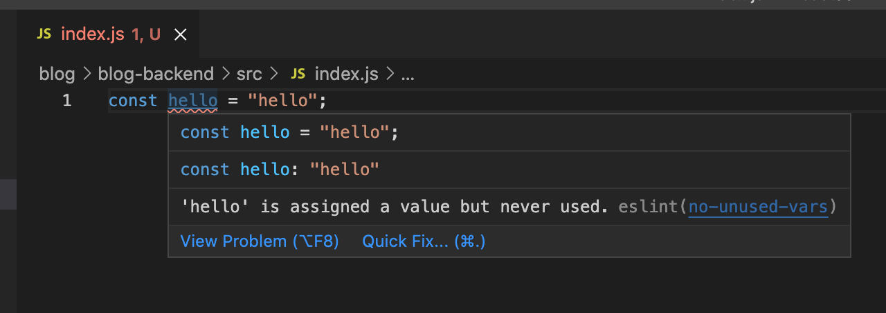

- 위와 같이 const로 값을 선언하고 사용하지 않으면, ESLint 기본 설정으로 이를 에러로 간주한다.
- 이러한 규칙을 끌 수 있다.

```json
// .eslintrc.json
{
    ...,
    "rules": {
        "no-unused-vars": "warn",
        "no-console": "off"
    }
}
```


## 🔥3. Koa 기본 사용법

### 3-1) 서버 띄우기

```javascript
// src/index.js
const Koa = require('koa');

const app = new Koa();

app.use((ctx) => {
  ctx.body = 'hello world';
});

app.listen(4000, () => {
  console.log('Listening to prot 4000');
});
```

```bash
$ node src
Listening to prot 4000
```

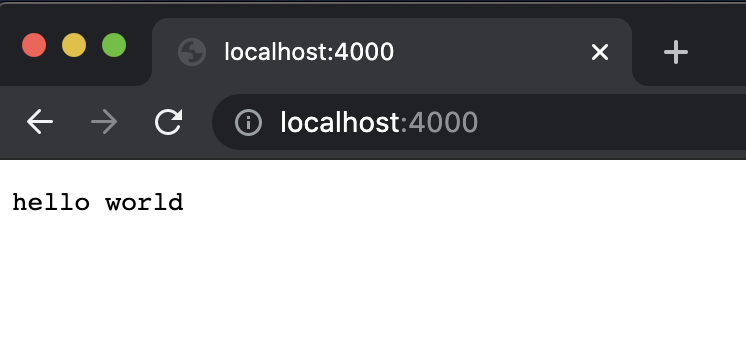


### 3-2) 미들웨어

- Koa 애플리케이션은 미들웨어의 배열로 구성되어 있다.

- `app.use` 함수는 미들웨어 함수를 애플리케이션에 등록한다.

- 미들웨어 함수는 다음과 같은 구조로 이루어져 있다.

  - ```javascript
    (ctx, next) => {
      
    }
    ```

- Koa의 미들웨어 함수는 두 개의 파라미터를 받는다.

  - 첫번째 파라미터는 `ctx`, 두번째 파라미터는 `next`이다.
  - `ctx`는 Context의 줄임말로 웹 요청과 응답에 관한 정보를 지니고 있다.
  - `next`는 현재 처리 중인 미들웨어의 다음 미들웨어를 호출하는 함수이다. 미들웨어를 등록하고 `next` 함수를 호출하지 않으면, 그 다음 미들웨어를 처리하지 않는다.
  - 주로 다음 미들웨어를 처리할 필요가 없는 라우트 미들웨어를 나중에 설정할 때 `ctx => {}` 같은 구조로 `next`를 생략하여 미들웨어를 작성한다.

```javascript
// src/index.js
const Koa = require('koa');

const app = new Koa();

app.use((ctx, next) => {
  console.log(ctx.url);
  console.log(1);
  next();
});

app.use((ctx, next) => {
  console.log(2);
  next();
});

app.use((ctx) => {
  ctx.body = 'hello world';
});

app.listen(4000, () => {
  console.log('Listening to prot 4000');
});
```

- 서버를 종료하고 다시 실행시켜서 결과를 확인해보자

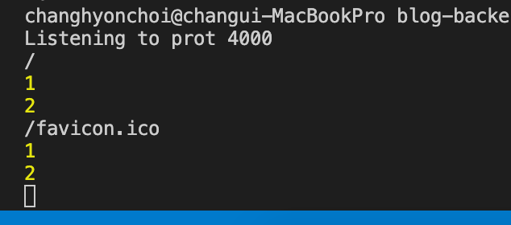

- 크롬 브라우저는 사용자가 웹 페이지에 들어가면 해당 사이트의 아이콘 파일인 /favicon.ico 파일을 서버에 요청하기 때문에 결과에 / 경로도 나타나고 /favicon.ico 경로도 나타난다.
- 이번에는 첫번째 미들웨어에서 호출하던 next 함수를 주석으로 처리해보자.

```javascript
// src/index.js
(...)

app.use((ctx, next) => {
  console.log(ctx.url);
  console.log(1);
  // next();
});

(...)
```

- next 를 호출하지 않으니 첫 번째 미들웨어까지만 실행하고 그 아래에 있는 미들웨어는 모두 무시되었다.

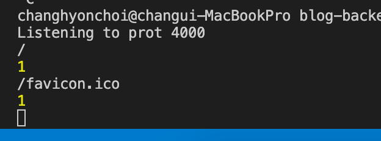

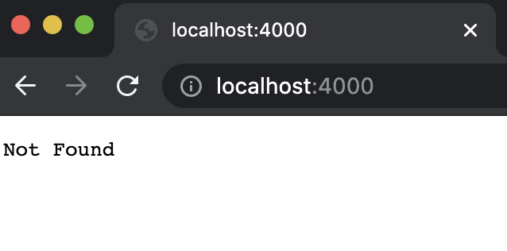


- 이런 속성을 이용하여 조건부로 다음 미들웨어 처리를 무시하게 만들 수 있다.

```javascript
// src/index.js
(...)
 
app.use((ctx, next) => {
  console.log(ctx.url);
  console.log(1);
  // 요청 경로에 authorized=1 이라는 쿼리 파라미터가 포함되어 있으면
  // 이후 미들웨어를 처리해주고, 그렇지 않으면 미들웨어를 처리하지 않는다.
  if (ctx.query.authorized !== '1') {
    ctx.status = 401; // Unauthorized
    return;
  }
  next();
});

(...)
```

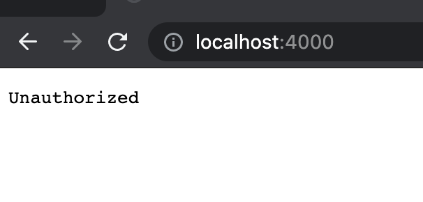

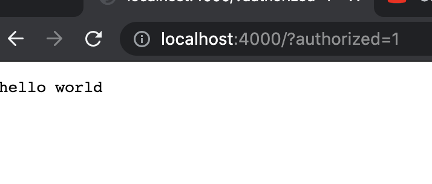


#### 3-2-1) next 함수는 Promise를 반환

- next 함수를 호출하면  Promise를 반환한다. 이는 Koa가 Express와 차별화되는 부분이다.
- next 함수가 반환하는 Promise는 **다음에 처리해야 할 미들웨어가 끝나야 완료된다**.

```javascript
// src/index.js
(...)

app.use((ctx, next) => {
  console.log(ctx.url);
  console.log(1);
  if (ctx.query.authorized !== '1') {
    ctx.status = 401; // Unauthorized
    return;
  }
  next().then(() => {
    console.log('END');
  });
});

(...)
```


#### 3-2-2) async/await 사용

```javascript
// src/index.js
(...)

app.use(async (ctx, next) => {
  console.log(ctx.url);
  console.log(1);
  if (ctx.query.authorized !== '1') {
    ctx.status = 401; // Unauthorized
    return;
  }
  await next();
  console.log('END');
});

(...)
```


## 🔥4. nodemon 사용

- nodemon 이라는 도구를 사용하면 코드를 변경할 때마다 서버를 자동으로 재시작해준다.

```bash
$ yarn add --dev nodemon
```

```json
// package.json
{
  ... ,
  "devDependencies": {
    "eslint": "^7.32.0",
    "nodemon": "^2.0.12"
  },
  "scripts": {
    "start": "node src",
    "start:dev": "nodemon --watch src/ src/index.js"
  }
}
```

- `start` 스크립트에는 서버를 시작하는 명령어를 넣는다.

- `start:dev` 스크립트에는 nodemon을 통해 서버를 실행해 주는 명령어를 넣어준다.

  - nodemon은 src디렉토리를 주시하고 있다가 해당 디렉토리 내부의 어떤 파일이 변경되면, 이를 감지하여 src/index.js 파일을 재시작해준다.

- 다음과 같은 명령어를 사용하여 서버를 시작할 수 있다.

  - ```bash
    $ yarn start	# 재시작이 필요 없을 때
    $ yarn start:dev	# 재시작이 필요할 때
    ```


## 🔥5. koa-router 사용

- 다른 주소로 요청이 들어올 경우 다른 작업을 처리할 수 있도록 라우터를 사용

```bash
$ yarn add koa-router
```

```js
// src/index.js
const Koa = require('koa');
const Router = require('koa-router');

const app = new Koa();
const router = new Router();

// 라우터 설정
router.get('/', (ctx) => {
  ctx.body = '홈';
});
router.get('/about', (ctx) => {
  ctx.body = '소개';
});

// app 인스턴스에 라우터 적용
app.use(router.routes()).use(router.allowedMethods());

app.listen(4000, () => {
  console.log('Listening to prot 4000');
});
```

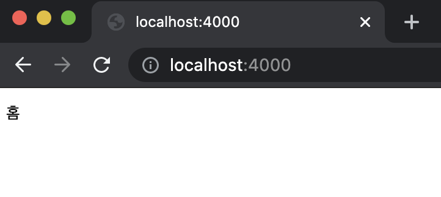

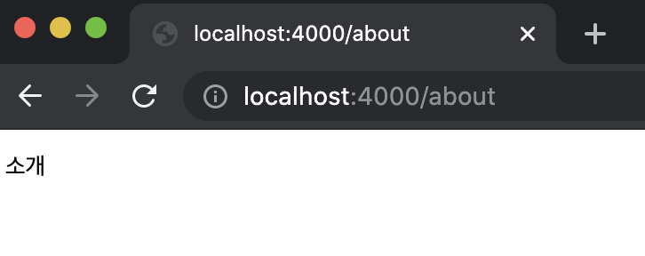


### 5-1) 라우트 파라미터와 쿼리

- 라우터의 파라미터를 설정할 때는 `/about/:name` 형식으로 **콜론(:)**을 사용하여 라우트 경로를 설정한다.
- 또한 파라미터가 있을 수도 있고, 없을 수도 있다면 `/about/:name?` 같은 형식으로 파라미터 이름 뒤에 **물음표**를 사용한다.
  - 이렇게 설정한 파라미터는 함수의 `ctx`,` params` 객체에서 조회할 수 있다.
- URL 쿼리의 경우, /posts/?id=10 같은 형식으로 요청했다면 해당 값을 `ctx.query` 에서 조회할 수 있다.

```javascript
// src/index.js
const Koa = require('koa');
const Router = require('koa-router');

const app = new Koa();
const router = new Router();

// 라우터 설정
router.get('/', (ctx) => {
  ctx.body = '홈';
});

router.get('/about/:name?', (ctx) => {
  const { name } = ctx.params;
  // name의 존재 유무에 따라 다른 결과 출력
  ctx.body = name ? `${name}의 소개` : '소개';
});

router.get('/posts', (ctx) => {
  const { id } = ctx.query;
  // id의 존재 유무에 따라 다른 결과 출력
  ctx.body = id ? `포스트 #${id}` : '포스트 아이디가 없습니다.';
});

// app 인스턴스에 라우터 적용
app.use(router.routes()).use(router.allowedMethods());

app.listen(4000, () => {
  console.log('Listening to prot 4000');
});
```

- 파라미터와 쿼리는 둘 다 주소를 통해 특정 값을 받아올 때 사용하지만, 용도가 조금씩 다르다.
  - 파라미터는 처리할 작업의 카테고리를 받아오거나, 고유 ID 혹은 이름으로 특정 데이터를 조회할 때 사용한다.
  - 쿼리는 옵션에 관련된 정보를 받아온다. 여러 항목을 리스팅하는 API라면, 어떤 조건을 만족하는 항목을 보여 줄지 또는 어떤 기준으로 정렬할지를  정해야 할 때 쿼리를 사용한다.

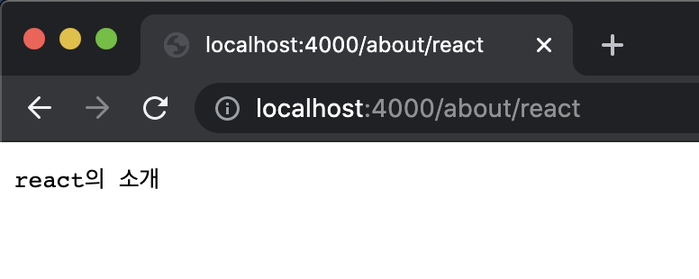

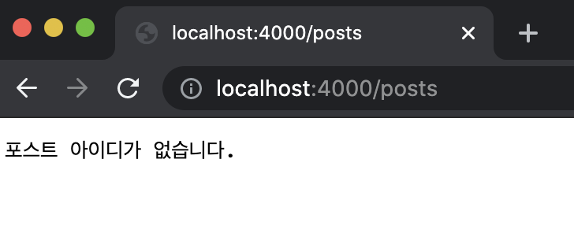

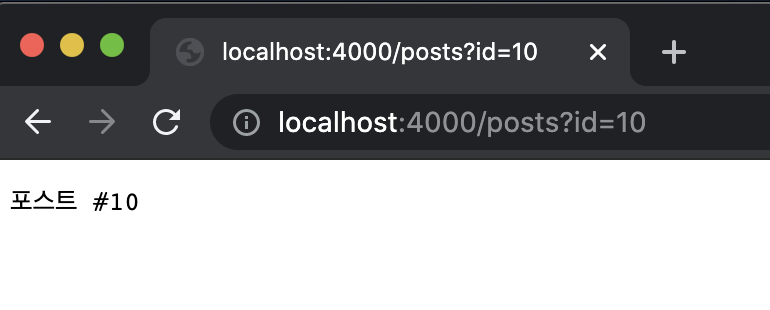


### 5-2) REST API

- 클라이언트가 서버에 자신이 데이터를 조회,생성,삭제,업데이트 하겠다고 요청하면, 서버는 필요한 로직에 따라 데이터베이스에 접근하여 작업을 처리한다.

- REST API는 요청 종류에 따라 다른 HTTP 메서드를 사용한다. 

- | 메서드 |                             설명                             |
  | :----: | :----------------------------------------------------------: |
  |  GET   |                 데이터를 조회할 때 사용한다.                 |
  |  POST  | 데이터를 등록할 때 사용한다. 인증 작업을 거칠 때 사용하기도 한다. |
  | DELETE |                  데이터를 지울 때 사용한다.                  |
  |  PUT   |        데이터를 새 정보로 통째로 교체할 때 사용한다.         |
  | PATCH  |           데이터의 특정 필드를 수정할 때 사용한다.           |

  블로그 포스트용 REST API 예시

  |                 종류                  |                            기능                            |
  | :-----------------------------------: | :--------------------------------------------------------: |
  |              POST /posts              |                        포스트 작성                         |
  |              GET /posts               |                      포스트 목록 조회                      |
  |            GET /posts/:id             |                      특정 포스트 조회                      |
  |           DELETE /posts/:id           |                      특정 포스트 삭제                      |
  |           PATCH /posts/:id            | 특정 포스트 업데이트(구현 방식에 따라 PUT으로도 사용 가능) |
  |       POST /posts/:id/comments        |                  특정 포스트에 덧글 등록                   |
  |        GET /posts/:id/comments        |                특정 포스트의 덧글 목록 조회                |
  | DELETE /posts/:id/comments/:commentId |                특정 포스트의 특정 덧글 삭제                |


### 5-3) 라우트 모듈화

- 프로젝트를 진행하면 여러 종류의 라우트를 만들게 되고, 각 라우트를 index.js 파일 하나에 모두 작성하면 코드가 길어지고 유지보수가 어려워진다.
- 라우터를 여러 파일에 분리시켜서 작성하고, 이를 불러와 적용하는 모듈화 작업으로 해결한다.

```javascript
// src/api/index.js
const Router = require('koa-router');
const api = new Router();

api.get('/test', (ctx) => {
  ctx.body = 'test 성공';
});

// 라우터를 내보낸다.
module.exports = api;
```

```javascript
// src/index.js
const Koa = require('koa');
const Router = require('koa-router');

const api = require('./api');

const app = new Koa();
const router = new Router();

// 라우터 설정
router.use('/api', api.routes()); // api 라우트 적용

// app 인스턴스에 라우터 적용
app.use(router.routes()).use(router.allowedMethods());

app.listen(4000, () => {
  console.log('Listening to prot 4000');
});
```

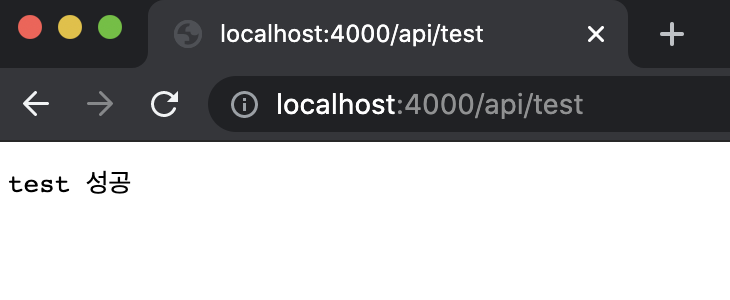


### 5-4) posts 라우트 생성

```js
// src/api/posts/index.js
const Router = require('koa-router');
const posts = new Router();

const printInfo = (ctx) => {
  ctx.body = {
    method: ctx.method,
    path: ctx.path,
    params: ctx.params,
  };
};

posts.get('/', printInfo);
posts.post('/', printInfo);
posts.get('/:id', printInfo);
posts.delete('/:id', printInfo);
posts.put('/:id', printInfo);
posts.patch('/:id', printInfo);
module.exports = posts;
```

```javascript
// src/api/index.js
const Router = require('koa-router');
const posts = require('./posts');

const api = new Router();

api.use('/posts', posts.routes());

// 라우터를 내보낸다.
module.exports = api;
```

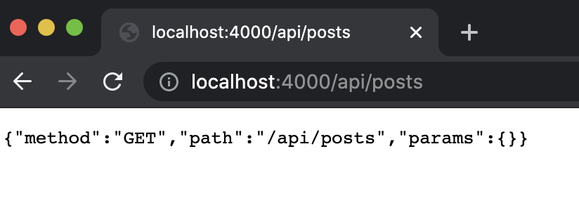


### 5-5) 컨트롤러 파일 작성

- 라우트를 작성하는 과정에서 특정 경로에 미들웨어를 등록할 때는 다음과 같이 두 번째 인자에 함수를 선언해서 바로 넣어 줄 수 있다.

```react
router.get('/', ctx => {
  
});
```

- 하지만 라우트 처리 함수의 코드가 길면 라우터 설정을 한눈에 보기 힘들다. 그렇기 때문에 이 라우트 처리 함수들을 다른 파일로 따로 분리해서 관리할 수 있다.
- 이렇게 <u>라우트 처리 함수만 모아 놓은 파일</u>을 **컨트롤러**라고 한다.

- API 기능을 간단하게 구현하면서 컨트롤러를 작성해보자.

- ```bash
  $ yarn add koa-bodyparser
  ```

  - koa-bodyparser 는 POST/PUT/PATCH 같은 메서드의 Request Body에 JSON 형식으로 데이터를 넣어주면, 이를 파싱하여 서버에서 사용할 수 있게 해준다.

  - 이 때 주의할 점은 router를 적용하는 코드의 윗부분에서 해야 한다.

  - ```javascript
    // src/index.js
    ...
    const bodyParser = require('koa-bodyparser');
    
    const api = require('./api');
    
    const app = new Koa();
    const router = new Router();
    
    // 라우터 설정
    router.use('/api', api.routes()); // api 라우트 적용
    
    // 라우터 적용 전에 bodyParser 적용
    app.use(bodyParser());
    
    // app 인스턴스에 라우터 적용
    app.use(router.routes()).use(router.allowedMethods());
    
    app.listen(4000, () => {
      console.log('Listening to prot 4000');
    });
    ```

```javascript
// src/api/post/posts.ctrl.js
let postId = 1; // id의 초기값

// posts 배열 초기 데이터
const posts = [
  {
    id: 1,
    title: '제목',
    body: '내용',
  },
];

/*  포스트 작성
    POST /api/posts
    { title, body }
*/
exports.write = (ctx) => {
  // REST API의 Request Body는 ctx.request.body에서 조회할 수 있다.
  const { title, body } = ctx.request.body;
  postId += 1; // 기존 postId 값에 1을 더한다.
  const post = { id: postId, title, body };
  posts.push(post);
  ctx.body = post;
};

/*  포스트 목록 조회
    GET /api/posts
*/
exports.list = (ctx) => {
  ctx.body = posts;
};

/*  특정 포스트 조회
    GET /api/posts/:id
 */
exports.read = (ctx) => {
  const { id } = ctx.params;
  // 주어진 id 값으로 포스트를 찾는다.
  // 파라미터로 받아 온 값은 문자열 형식이므로 파라미터를 숫자로 변환하거나 비교할 p.id값을 문자열로 변경해야 한다.
  const post = posts.find((p) => p.id.toString() === id);
  // 포스트가 없으면 오류를 반환한다.
  if (!post) {
    ctx.state = 404;
    ctx.body = {
      message: '포스트가 존재하지 않는다.',
    };
    return;
  }
  ctx.body = post;
};

/*  특정 포스트 제거
    DELETE /api/post/:id
*/
exports.remove = (ctx) => {
  const { id } = ctx.params;
  // 해당 id를 가진 post가 몇번째인지 확인한다.
  const index = posts.findIndex((p) => p.id.toString() === id);
  // 포스트가 없으면 오류를 반환한다.
  if (index === -1) {
    ctx.status = 404;
    ctx.body = {
      message: '포스트가 존재하지 않는다.',
    };
    return;
  }
  // index번째 아이템을 제거한다.
  posts.splice(index, 1);
  ctx.status = 204; // No Content
};

/*  포스트 수정(교체)
    PUT /api/posts/:id
    { title, body }
*/
exports.replace = (ctx) => {
  // PUT 메서드는 전체 포스트 정보를 입력하여 데이터를 통째로 교체할 때 사용한다.
  const { id } = ctx.params;
  // 해당 id를 가진 post가 몇번째인지 확인한다.
  const index = posts.findIndex((p) => p.id.toString() === id);
  // 포스트가 없으면 오류를 반환한다.
  if (index === -1) {
    ctx.status = 404;
    ctx.body = {
      message: '포스트가 존재하지 않는다.',
    };
    return;
  }
  // 전체 객체를 덮어 씌운다.
  // 따라서 id를 제외한 기존 정보를 날리고, 객체를 새로 만든다.
  posts[index] = {
    id,
    ...ctx.request.body,
  };
  ctx.body = posts[index];
};

/*  포스트 수정(특정 필드 변경)
    PATCH /api/posts/:id
    { title, body }
*/
exports.update = (ctx) => {
  // PATCH 메서드는 주어진 필드만 교체한다.
  const { id } = ctx.params;
  // 해당 id를 가진 post가 몇번째인지 확인한다.
  const index = posts.findIndex((p) => p.id.toString() === id);
  // 포스트가 없으면 오류를 반환한다.
  if (index === -1) {
    ctx.status = 404;
    ctx.body = {
      message: '포스트가 존재하지 않는다.',
    };
    return;
  }
  // 기존 값에 정보를 덮어 씌운다.
  posts[index] = {
    ...posts[index],
    ...ctx.request.body,
  };
  ctx.body = posts[index];
};
```

- 컨트롤러를 만들면서 `exports.이름 = ...` 형식으로 함수를 내보냈다. 이렇게 내보낸 코드는 다음 형식으로 불러올 수 있다.

  - ```javascript
    const 모듈이름 = require('파일이름');
    모듈이름.이름();
    ```

  - `Require('./posts.ctrl')` 을 입력하여 posts.ctrls.js 파일을 불러온다면 다음 객체를 불러오게 된다.

  - ```javascript
    {
      write: Function,
      list: Fucntion,
      read: Fucntion,
      remove: Fucntion,
      replace: Fucntion,
      update: Fucntion,
    };
    ```

```javascript
// src/api/posts/index.js
const Router = require('koa-router');
const postsCtrl = require('./posts.ctrl');

const posts = new Router();

posts.get('/', postsCtrl.list);
posts.post('/', postsCtrl.write);
posts.get('/:id', postsCtrl.read);
posts.delete('/:id', postsCtrl.remove);
posts.put('/:id', postsCtrl.replace);
posts.patch('/:id', postsCtrl.update);

module.exports = posts;
```

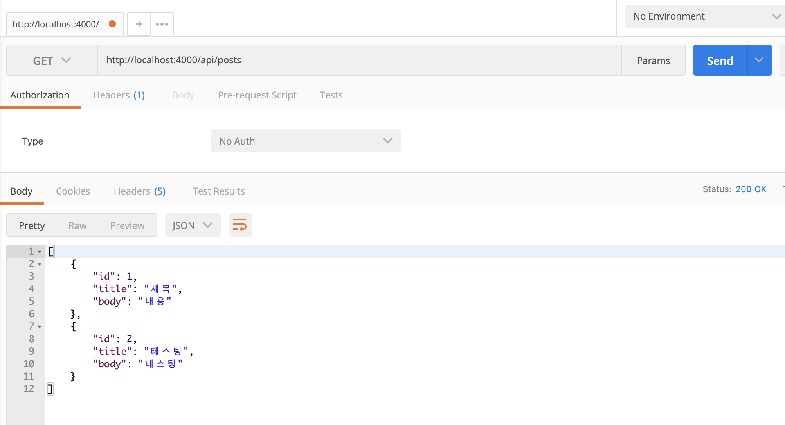


- update와 replace 함수는 용도는 비슷하지만 구현 방식이 다르다.

  - update(PATCH)는 기존 값은 유지하면서 새 값을 덮어 씌운다.
  - replace(PUT)은 Request Body로 받은 값이 id를 제외한 모든 값을 대체한다.

- 

  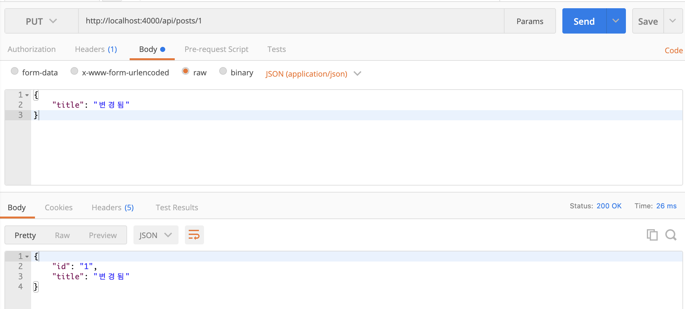

- PATCH로 했을 때는 기존 body 내용을 유지하며, title 값만 변경되었다.
- PUT으로 했을 때는 기존 body가 사라졌다.

