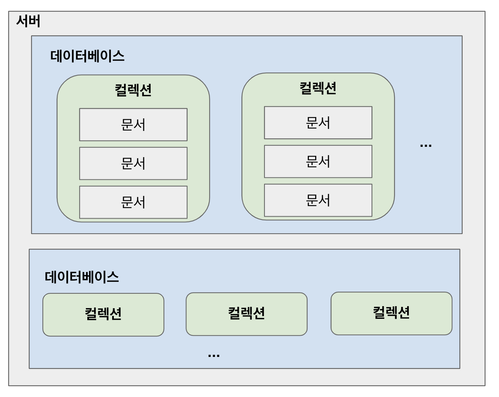
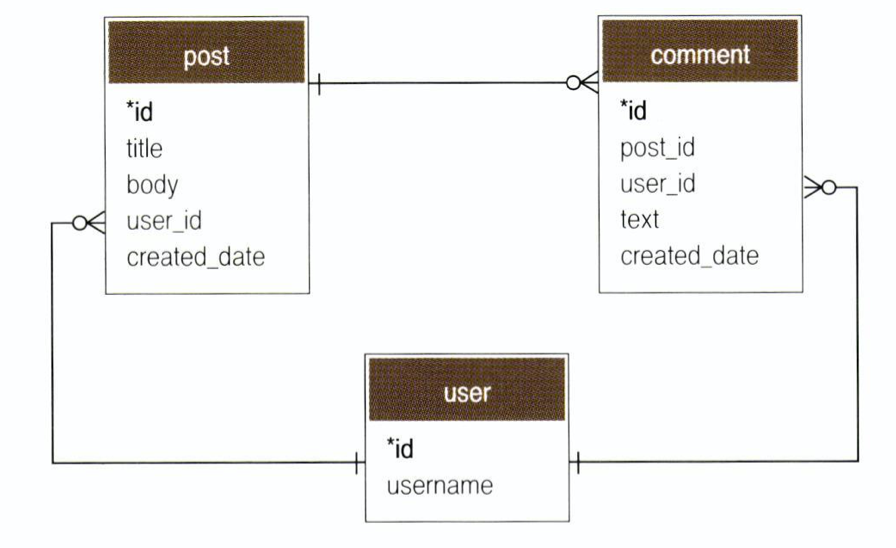
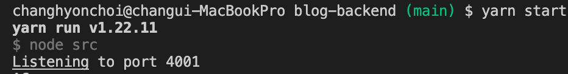
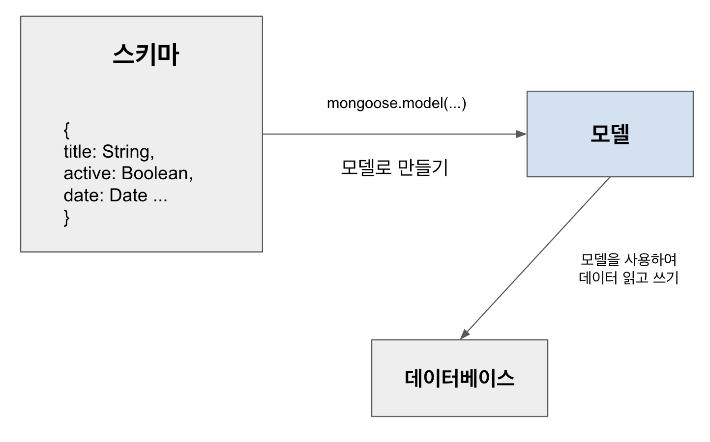
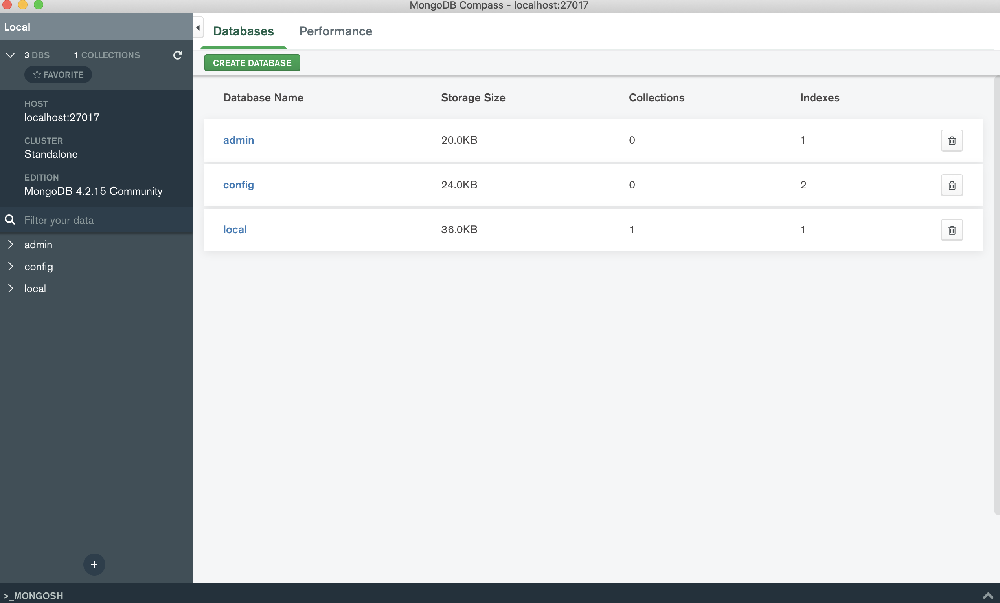
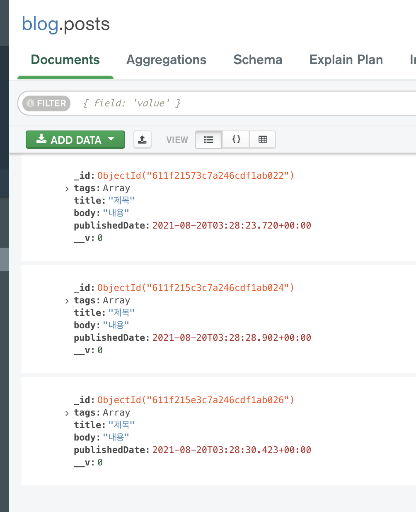
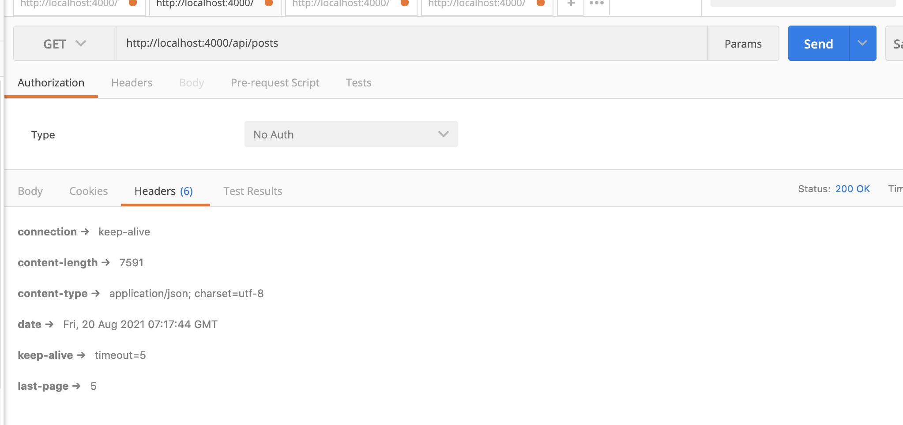

# ReactJS-22 mongoose를 이용한 MongoDB 연동


## 🔥1. MongoDB

- 서버를 개발할 때 데이터베이스를 사용하면 웹 서비스에서 사용되는 데이터를 저장하고, 효율적으로 조회하거나 수정할 수 있다.
- 기존에는 MySQL, OracleDB, PostgreSQL 같은 RDBMS(관계형 데이터베이스)를 자주 사용했다.
- 그러나 관계형 데이터베이스의 한계가 존재한다.
  1. 데이터 스키마가 고정적이다.
     - 스키마: 데이터베이스에 어떤 형식의 데이터를 넣을지에 대한 정보를 가리킨다.
     - 새로 등록하는 데이터 형식이 기존에 있던 데이터들과 다르면, 기존 데이터를 모두 수정해야 새 데이터를 등록할 수 있다.
     - 데이터 양이 많을 때는 데이터베이스의 스키마를 변경하는 작업이 매우 번거롭다.
  2. 확장성
     - RDMS는 저장하고 처리해야 할 데이터양이 늘어나면 여러 컴퓨터에 분산시키는 것이 아니라, 해당 데이터베이스 서버의 성능을 업그레이드하는 방식으로 확장해 주어야 한다.
- MongoDB는 이러한 한계를 극복한 문서 지향적 NoSQL 데이터베이스이다.
  - 데이터베이스에 등록하는 데이터들은 유동적인 스키마를 지닐 수 있다.
  - 여러 컴퓨터로 분산하여 처리할 수 있도록 확장하기 쉽게 설계되어 있다.
- 상황별로 적합한 데이터베이스를 선택하는 것이 중요하다.
  - 데이터의 구조가 자주 바뀐다면 MongoDB가 유리하다.
  - 까다로운 조건으로 데이터를 필터링해야 하거나, ACID 특성을 지켜야 한다면 RDBMS가 유리하다.
  - (ACID 특성은 원자성(Atomicity), 일관성(Consistency), 고립성(Isolation), 지속성(Durability)의 앞 글자를 떠서 만든 용어이고, 데이터베이스 트랜잭션이 안전하게 처리되는 것을 보장하기 위한 성질을 의미한다.)

### 1-1) 문서

- 여기서 말하는 '문서(document)'는 RDBMS의 레코드(record)와 개념이 비슷하다.

- 문서의 데이터 구조는 한 개 이상의 키-값 쌍으로 되어 있다.

  - ```json
    // 문서 예시
    {
      "_id": ObejctId("5023951200ab23400fe034"),
      "username": "chichi",
      "name": { first: "C.H.", last: "Choi" }
    }
    ```

- 문서는 BSON(바이너리 형태의 JSON) 형태로 저장된다. 그렇기 때문에 나중에 JSON 형태의 객체를 데이터베이스에 저장할 때, 큰 공수를 들이지 않고 데이터베이스에 등록할 수 있다.

- 새로운 문서를 만들면 _id라는 고유값을 자동으로 생성하는데, 이 값은 시간, 머신 아이디, 프로세스 아이디, 순차 번호로 되어 있어 값의 고유함을 보장한다.

- 여러 문서가 들어있는 곳을 컬렉션 이라고 한다.

  - 기존 RDBMS에서는 테이블 개념을 사용하므로 각 테이블마다 같은 스키마를 가지고 있어야 한다.

  - 새로 등록해야 할 데이터가 다른 스키마를 가지고 있다면, 기존 데이터들의 스키마도 모두 바꾸어 주어야 한다.

  - 반면 MongoDB는 다른 스키마를 가지고 있는 문서들이 한 컬렉션에서 공존할 수 있다.

    - ```json
      {
        "_id": ObejctId("5023951200ab23400fe034"),
        "username": "chichi",
        "name": { first: "C.H.", last: "Choi" }
      },
      {
        "_id": ObejctId("5023951200ab23400fe035"),
        "username": "chichi2",
        "phone": "010-1234-1234"
      }
      ```


### 1-2) MongoDB 구조

- 서버 하나에 데이터베이스를 여러 개 가지고 있을 수 있다.
- 각 데이터베이스에는 여러 개의 컬렉션이 있다.
- 컬렉션 내부에는 문서들이 있다.




### 1-3) 스키마 디자인

- MongoDB에서 스키마를 디자인하는 방식은 기존 RDBMS에서 스키마를 디자인하는 방식과 완전히 다르다.
- 기존의 RDBMS로 디자인한다면 다음과 같다.



- NoSQL에서는 그냥 모든 것을 문서 하나에 넣는다.

```json
{
  id: ObjectId,
  title: String,
	body: String,
  username: String,
  createdDate: Date,
  comments: [
    {
      _id: ObejctId,
      text: String,
      createdDate: Date
    }
  ]
}
```


## 🔥2. MongoDB 서버 준비

### 2-1) 설치

```bash
$ brew tap mongodb/brew
$ brew install mongodb-community@4.2
$ brew services start mongodb-community@4.2
```

### 2-2) MongoDB 작동 확인

```bash
$ mongo
MongoDB shell version v4.2.15
connecting to: mongodb://127.0.0.1:27017/?compressors=disabled&gssapiServiceName=mongodb
Implicit session: session { "id" : UUID("beaccfbd-b0b9-496a-b3a6-e9d0705adb33") }
MongoDB server version: 4.2.15
...
```

- `Mongo Not Found` 가 표시될 경우 mongo가 설치된 path를 참조할 수 있게 설정해준다.([참고](https://stackoverflow.com/questions/22862808/mongod-command-not-found-os-x))

```bash
> version()
4.2.15
```


## 🔥3. mongoose의 설치 및 적용

- mongoose는 Node.js 환경에서 사용하는 MongoDB 기반 ODM(Object Data Modelling) 라이브러이다.
- 데이터베이스 문서들을 자바스크립트 객체처럼 사용할 수 있게 해준다.
- 백엔프 프로젝트에 이어서 진행함으로 프로젝트 디렉터리에서 다음 명령어를 입력한다.

```bash
$ yarn add mongoose dotenv
```

- dotenv는 환경변수들을 파일에 넣고 사용할 수 있게 하는 개발도구이다.

- mongoose를 사용하여 MongoDB에 접속할 때, 서버에 주소나 계정 및 비밀번호가 필요하다. 이렇게 민감하고 환경별로 달라질 수 있는 값은 코드 안에 작성하지 않고, 환경변수로 설정하는 것이 좋다.

  

### 3-1) .env 환경변수 파일 생성

- 프로젝트 루트 경로에 .env 파일을 만든다.

```text
# .env
PORT=4000
MONGO_URI=mongodb://localhost:27017/blog
```

- 여기서 blog는 우리가 사용할 데이터베이스 이름이다. 지정한 데이터베이스가 서버에 없다면 자동으로 만들어준다.

```javascript
// src/index.js
require('dotenv').config();
(...)

// 비구조화 할당을 통해 process.env 내부 값에 대한 레퍼런스 만들기
const { PORT } = process.env;

(...)

// PORT가 지정되어 있지 않다면 4000을 사용
const port = PORT || 4000;
app.listen(port, () => {
  console.log('Listening to port %d', port);
});
```

- .env 파일에서 PORT를 4001로 변경한 뒤 서버를 재시작하면 바뀐 포트로 실행된 것을 볼 수 있다.




### 3-2) mongoose로 서버와 데이터베이스 연결

```javascript
(...)
const mongoose = require('mongoose');

// 비구조화 할당을 통해 process.env 내부 값에 대한 레퍼런스 만들기
const { PORT, MONGO_URI } = process.env;

mongoose
  .connect(MONGO_URI, { useNewUrlParser: true, useFindAndModify: false })
  .then(() => {
    console.log('Connected to MongoDB');
  })
  .catch((e) => {
    console.error(e);
  });

(...)
```


## 🔥4. esm으로 ES 모듈 import/export 문법 사용

- 리액트 프로젝트에서 사용해 오던 ES 모듈 import/export 문법은 Node.js에서 아직 정식 지원되지 않는다.
- 깔끔한 코드를 위해 사용할 수 있도록 설정한다.

```bash
$ yarn add esm
```

- 기존 src/index.js 파일의 이름을 main.js로 변경하고, index.js 파일을 새로 생성해서 다음과 같이 작성한다.

```javascript
// src/index.js
// 이 파일에서만 no-global-assign ESLint 옵션을 비활성화한다.
/* eslint-disable no-global-assign */

require = require('esm')(module /*, options*/);
module.exports = require('./main.js');
```

- package.json 파일에서 스크립트도 수정해준다.

```json
// package.json
{
  ...,
  "scripts": {
    "start": "node -r esm src",
    "start:dev": "nodemon --watch src/ -r esm src/index.js"
  }
}
```

- ESLint에서 import/export 구문을 사용해도 오류로 간주하지 않도록 다음과 같이 .eslintrc.json 을 수정한다.

```json
// .eslintrc.json
{
  ...,
  "parserOptions": {
    "ecmaVersion": 12,
    "sourceType": "module"
  },
  ...,
}
```

- 그리고 현재까지 작성한 코드 파일들을 import/export 구문으로 수정한다.


## 🔥5. 데이터베이스의 스키마와 모델

- mongoose에는 **스키마(schema)**와 **모델(model)**이라는 개념이 있다.
- 스키마는 컬렉션에 들어가는 문서 내부의 각 필드가 어떤 형식으로 되어 있는지 정의하는 객체이다.
- 모델은 스키마를 사용하여 만드는 인스턴스로, 데이터베이스에서 실제 작업을 처리할 수 있는 함수들을 지니고 있는 객체이다.




### 5-1) 스키마 생성

- 모델을 만들려면 스키마를 만들어 줘야 한다.

- 블로그 포스트에 대한 스키마를 정의해보자.

  - 제목, 내용, 태그, 작성일

- |   필드 이름   | 데이터 타입 |   설명    |
  | :-----------: | :---------: | :-------: |
  |     title     |   문자열    |   제목    |
  |     body      |   문자열    |   내용    |
  |     tags      | 문자열 배열 | 태그 목록 |
  | publishedDate |    날짜     | 작성 날짜 |

```javascript
// src/models/post.js
import mongoose from 'mongoose';

const { Schema } = mongoose;

const PostSchema = new Schema({
  title: String,
  body: String,
  tags: [String], // 문자열로 이루어진 배열
  publishedDate: {
    type: Date,
    default: Date.now, // 현재 날짜를 기본값으로 지정
  },
});
```

- Schema에서 기본적으로 지원하는 타입은 다음과 같다.

|               타입               |                     설명                     |
| :------------------------------: | :------------------------------------------: |
|              String              |                    문자열                    |
|              Number              |                     숫자                     |
|               Date               |                     날짜                     |
|              Buffer              |           파일을 담을 수 있는 버퍼           |
|             Boolean              |              true 또는 false 값              |
|    Mixed(Schema, Types.Mixed)    |       어떤 데이터도 넣을 수 있는 형식        |
| ObjectId(Schema, Types.ObjectId) | 객체 아이디, 주로 다른 객체를 참조할 때 넣음 |
|              Array               |     배열 형태의 값으로 [ ]로 감싸서 사용     |

- 다음과 같이 좀 더 복잡한 방식의 스키마를 선언하여 데이터를 저장할 수 있다.
  - 스키마 내부에 다른 스키마를 내장시킬 수 있다.

```javascript
const AuthorSchema = new Schema({
  name: String,
  email: String,
});
const BookSchema = new Schema({
  title: String,
  description: String,
  authors: [AuthorSchema],
  meta: {
    likes: Number,
  },
  extra: Schema.Types.Mixed
});
```


### 5-2) 모델 생성

- model() 함수는 두 개의 파라미터가 필요하다.
  - 첫번째 파라미터는 스키마 이름
  - 두번째 파라미터는 스키마 객체
- 데이터베이스는 스키마 이름을 정해 주면 그 이름의 복수 형태로 데이터베이스에 컬렉션 이름을 만든다.

```javascript
// src/models/post.js
(...)

const Post = mongoose.model('Post', PostSchema);
export default Post;
```


## 🔥6. MongoDB Compass 의 설치 및 사용

- [MongoDB Compass](https://www.mongodb.com/try/download/compass)




## 🔥7. 데이터 생성과 조회

### 7-1) 데이터 생성

```javascript
// src/api/posts/posts.ctrl.js
import Post from '../../models/post';

/*
  POST /api/posts
  {
    title: '제목',
    body: '내용',
    tags: ['태그1', '태그2']
  }
*/
export const write = async (ctx) => {
  const { title, body, tags } = ctx.request.body;
  const post = new Post({
    title,
    body,
    tags,
  });
  try {
    await post.save();
    ctx.body = post;
  } catch (e) {
    ctx.throw(500, e);
  }
};
```

- 포스트의 인스턴스를 만들 때는 `new` 키워드를 사용한다.
- 인스턴스를 만들고 `save()` 함수를 실행시키면 데이터베이스에 저장된다. 이 함수의 반환값은 Promise 이므로 async/await 문법으로 데이터베이스 저장 요청을 완료할 때까지 기다릴 수 있다.




### 7-2) 데이터 조회

- 데이터를 조회할 때는 모델 인스턴스의 `find()` 함수를 사용한다.

```javascript
// src/api/posts/posts.ctrl.js

/*
  GET /api/posts
*/
export const list = async (ctx) => {
  try {
    const posts = await Post.find().exec();
    ctx.body = posts;
  } catch (e) {
    ctx.throw(500, e);
  }
};
```


### 7-3) 특정 포스트 조회

- 특정 id를 가진 데이터를 조회할 때는 `findById()` 함수를 사용한다.

```javascript
/*
  GET /api/posts/:id
*/
export const read = async (ctx) => {
  const { id } = ctx.params;
  try {
    const post = await Post.findById(id).exec();
    if (!post) {
      ctx.status = 404; // Not Found
      return;
    }
    ctx.body = post;
  } catch (e) {
    ctx.throw(500, e);
  }
};
```


## 🔥8. 데이터 삭제와 수정

### 8-1) 데이터 삭제

- `remove()`: 특정 조건을 만족하는 데이터를 모두 지운다.
- `findByIdAndRemove()`: id를 찾아서 지운다.
- `findOneAndRemove()`: 특정 조건을 만족하는 데이터 하나를 찾아서 제거한다.

```javascript
/*
  DELETE /api/posts/:id
*/
export const remove = async (ctx) => {
  const { id } = ctx.params;
  try {
    await Post.findByIdAndRemove(id).exec();
    ctx.status = 204; // No Content (성공하기는 했지만 응답할 데이터는 없음)
  } catch (e) {
    ctx.throw(500, e);
  }
};
```


### 8-2 데이터 수정

- 데이터를 업데이트할 때는 findByIdAndUpdate() 함수를 사용한다.
  - 첫번째 파라미터는 id
  - 두번쨰 파라미터는 업데이트 내용
  - 세번째 파라미터는 업데이트의 옵션

```javascript
/*
  PATCH /api/posts/:id
  {
    title: '수정',
    body: '수정 내용',
    tags: ['수정', '태그']
  }
*/
export const update = async (ctx) => {
  const { id } = ctx.params;
  try {
    const post = await Post.findByIdAndUpdate(id, ctx.request.body, {
      // 이 값을 설정하면 업데이트된 데이터를 반환
      // false일 때는 업데이트되기 전의 데이터를 반환
      new: true,
    }).exec();
    if (!post) {
      ctx.status = 404;
      return;
    }
    ctx.body = post;
  } catch (e) {
    ctx.throw(500, e);
  }
};
```


## 🔥9. 요청 검증

### 9-1) ObjectId 검증

- 앞에서 read API를 실행할 때, id가 올바른 ObjectId 형식이 아니면 500오류가 발생했다.
- 500오류는 보통 서버에서 처리하지 않아 내부적으로 문제가 생겼을 때 발생한다.
- 잘못된 id를 전달했다면 클라이언트가 요청을 잘못 보낸 것이니 400 Bad Request 오류를 띄어주는 것이 맞다.
- 그러려면 id값이 올바른 ObjectId 인지 확인해야 한다.

```javascript
import mongoose from 'mongoose';

const { ObjectId } = mongoose.Types;
ObjectId.isValid(id);
```

```javascript
// src/api/posts/posts.ctrl.js
import Post from '../../models/post';
import mongoose from 'mongoose';

const { ObjectId } = mongoose.Types;

export const checkObjectId = (ctx, next) => {
  const { id } = ctx.params;
  if (!ObjectId.isValid(id)) {
    ctx.status = 400; // Bad Request
    return;
  }
  return next();
};
(...)
```

```javascript
// src/api/posts/index.js
import Router from 'koa-router';
import * as postsCtrl from './posts.ctrl';

const posts = new Router();

posts.get('/', postsCtrl.list);
posts.post('/', postsCtrl.write);

const post = new Router(); // /api/posts/:id
posts.get('/', postsCtrl.read);
posts.delete('/', postsCtrl.remove);
posts.patch('/', postsCtrl.update);

posts.use('/:id', postsCtrl.checkObjectId, post.route());

export default posts;
```


### 9-2) Request Body 검증

- 포스트를 작성할 때 서버는 title, body, tags 값을 모두 전달받아야 한다.
- 클라이언트가 값을 빼먹었을때는 400 오류가 발생해야 한다.
- 따로 처리하지 않는 경우 요청 내용을 비운 상태에서 write API를 실행해도 요청이 성공하여 비어 있는 포스트가 등록된다.
- 각 값을 if문으로 비교하는 방법도 있지만, 이를 수월하게 해주는 [Joi](https://www.npmjs.com/package/joi) 라이브러리를 활용하여 검증해주자.

```bash
$ yarn add joi
```

```javascript
...
import Joi from 'joi';

(...)

/*
  POST /api/posts
  {
    title: '제목',
    body: '내용',
    tags: ['태그1', '태그2']
  }
*/
export const write = async (ctx) => {
  const schema = Joi.object().keys({
    // 객체가 다음 필드를 가지고 있음을 검증
    title: Joi.string().required(), // required()가 있으면 필수 항목
    body: Joi.string().required(),
    tags: Joi.array().items(Joi.string()).required(), // 문자열로 이루어진 배열
  });

  // 검증하고 나서 검증 실패인 경우 에러처리
  const result = schema.validate(ctx.request.body);
  if (result.error) {
    ctx.status = 400; // Bad Request
    ctx.body = result.error;
    return;
  }

  const { title, body, tags } = ctx.request.body;
  const post = new Post({
    title,
    body,
    tags,
  });
  try {
    await post.save();
    ctx.body = post;
  } catch (e) {
    ctx.throw(500, e);
  }
};

(...)
```


## 🔥10. 페이지네이션 구현

- list API는 현재 작성된 모든 포스트를 불러오는데, 만약 포스트 개수가 몇 백개라면 로딩 속도가 느려진다.
- list API에 페이지네이션 기능을 구현해보자

### 10-1) 가짜 데이터 생성하기

```javascript
// src/createFakeData.js
import Post from './models/post';

export default function createFakeData() {
  // 0, 1, ... , 39로 이루어진 배열을 생성한 후 포스트 데이터로 변환
  const posts = [...Array(40).keys()].map((i) => ({
    title: `포스트 #${i}`,
    // https://www.lipsum.com/ 에서 복사한 200자 이상의 텍스트
    body: 'It is a long established fact that a reader will be distracted by the readable content of a page when looking at its layout. The point of using Lorem Ipsum is that it has a more-or-less normal distribution of letters, as opposed to using Content here, content here, making it look like readable English. Many desktop publishing packages and web page editors now use Lorem Ipsum as their default model text, and a search for lorem ipsum will uncover many web sites still in their infancy. Various versions have evolved over the years, sometimes by accident, sometimes on purpose (injected humour and the like).',
    tags: ['가짜', '데이터'],
  }));

  Post.insertMany(posts, (err, docs) => {
    console.log(docs);
  });
}
```

- main.js에서 함수를 한번 호출할 수 있도록 한다.
- 데이터가 등록되면 지우던지 주석처리를 해준다.

```javascript
// src/main.js
(...)
import createFakeData from './createFakeData';
(...)
 
mongoose
  .connect(MONGO_URI, { useNewUrlParser: true, useFindAndModify: false })
  .then(() => {
    console.log('Connected to MongoDB');
    // createFakeData();
  })
  .catch((e) => {
    console.error(e);
  });
(...)
```


### 10-2) 포스트를 역순으로 불러오기

- list API에서  exec() 하기 전에 sort() 구문을 넣는다.
- sort 함수의 파라미터는 { key: 1 } 형식으로 넣는다.
  - key는 정렬할 필드를 설정
  - 오른쪽 값을 1로 설정하면 오름차순, -1로 설정하며 내림차순

```javascript
/*
  GET /api/posts
*/
export const list = async (ctx) => {
  try {
    const posts = await Post.find().sort({ _id: -1 }).exec();
    ctx.body = posts;
  } catch (e) {
    ctx.throw(500, e);
  }
};
```


### 10-3) 보이는 개수 제한

- 개수를 제한할 때는 limit() 함수를 사용, 파라미터에는 제한할 숫자를 넣는다.

```javascript
/*
  GET /api/posts
*/
export const list = async (ctx) => {
  try {
    const posts = await Post.find().sort({ _id: -1 }).limit(10).exec();
    ctx.body = posts;
  } catch (e) {
    ctx.throw(500, e);
  }
};
```


### 10-4) 페이지 기능 구현

- skip 함수 사용
  - 파라미터로 10을 넣어주면, 처음 열개를 제외하고 그다음 데이터를 불러온다.
  - 20을 넣어주면, 처음 20개를 제외하고 그다음 데이터를 불러온다.
  - (page-1) * 10 을 넣어서 해결!

```javascript
/*
  GET /api/posts
*/
export const list = async (ctx) => {
  // query는 문자열이기 때문에 숫자로 변환해줘야한다.
  // 값이 주어지지 않는다면 1을 기본으로 사용한다.
  const page = parseInt(ctx.query.page || '1', 10);

  if (page < 1) {
    ctx.status = 400;
    return;
  }

  try {
    const posts = await Post.find()
      .sort({ _id: -1 })
      .limit(10)
      .skip((page - 1) * 10)
      .exec();
    ctx.body = posts;
  } catch (e) {
    ctx.throw(500, e);
  }
};
```

- localhost:4000/api/posts?page=2 형식으로 페이지를 지정하여 조회 가능하다.


### 10-5) 마지막 페이지 번호 알려주기

- 커스텀 헤더를 설정하여 마지막 페이지 번호 정보를 클라이언트에게 넘겨줄 수 있다.

```javascript
/*
  GET /api/posts
*/
export const list = async (ctx) => {
  // query는 문자열이기 때문에 숫자로 변환해줘야한다.
  // 값이 주어지지 않는다면 1을 기본으로 사용한다.
  const page = parseInt(ctx.query.page || '1', 10);

  if (page < 1) {
    ctx.status = 400;
    return;
  }

  try {
    const posts = await Post.find()
      .sort({ _id: -1 })
      .limit(10)
      .skip((page - 1) * 10)
      .exec();
    const postCount = await Post.countDocuments().exec();
    ctx.set('Last-Page', Math.ceil(postCount / 10));
    ctx.body = posts;
  } catch (e) {
    ctx.throw(500, e);
  }
};
```

- Last-Page 라는 커스텀 HTTP 헤더를 설정하였다.




### 10-6) 내용 길이 제한

- body의 길이가 200자 이상이면 뒤에 '...'을 붙이고 문자열을 자르는 기능을 구현해보자.
- `find()`를 통해 조회한 데이터는 mongoose 문서 인스턴스 형태이므로 데이터를 바로 변형할 수 없다.
- `toJSON()` 함수를 실행하여 JSON 형태로 변환한 뒤 수정을 한다.

```javascript
/*
  GET /api/posts
*/
export const list = async (ctx) => {
  (...)
    ctx.body = posts
      .map((post) => post.toJSON())
      .map((post) => ({
        ...post,
        body:
          post.body.length < 200 ? post.body : `${post.body.slice(0, 200)}...`,
      }));
  } catch (e) {
    ctx.throw(500, e);
  }
};
```

