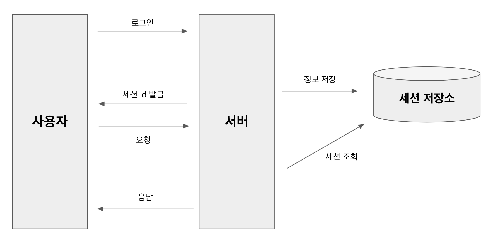
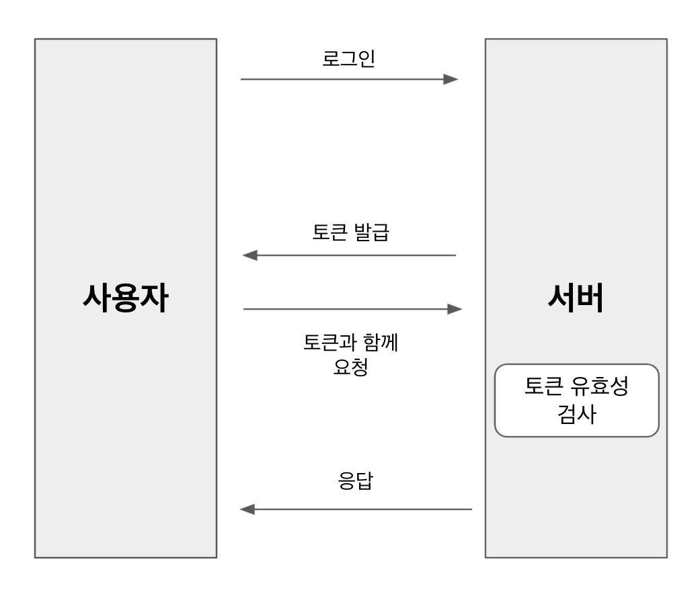
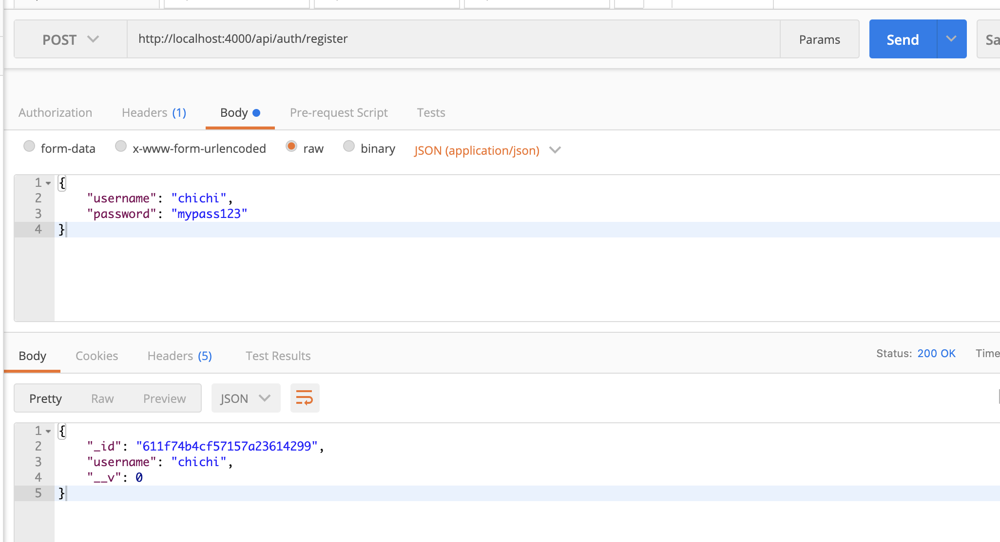
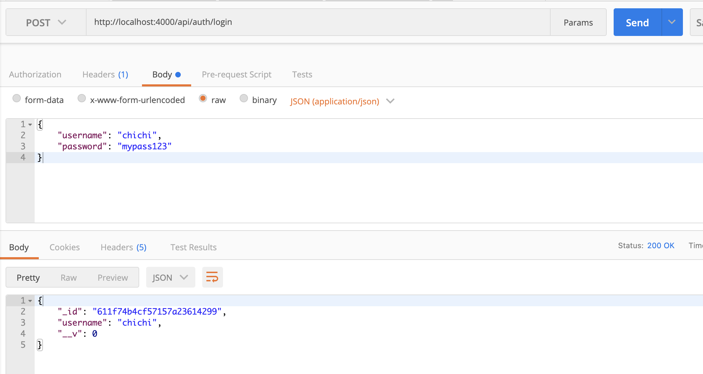

# ReactJS-23 JWT를 통한 회원 인증 시스템 구현


## 🔥1. JWT의 이해

- JSON Web Token 의 약자
- 데이터가 JSON으로 이루어져 있는 토큰을 의미한다.
- 두 개체가 서로 안전하게 정보를 주고 받을 수 있도록 웹 표준으로 정의된 기술


### 1-1) 세션 기반 인증과 토큰 기반 인증의 차이

1. 세션 기반 인증 시스템

   - 서버가 사용자가 로그인 중임을 기억하고 있는 것이다.
   - 사용자가 로그인을 하면, 서버는 세션 저장소에 사용자의 정보를 조회하고 세션 id를 발급한다.
   - 발급된 id는 주로 브라우저의 쿠키에 저장한다.
   - 사용자가 다른 요청을 보낼 때마다 서버는 세션 저장소에 세션을 조회한 후 로그인 여부를 결정하여 작업을 처리하고 응답한다.
   - 세션 저장소는 주로 메모리, 디스크, 데이터베이스 등을 사용한다.
   - 세션 기반 인증의 단점은 서버를 확장하기가 번거롭다. 만약 서버의 인스턴스가 여러개라면, 모든 서버끼리 같은 세션을 공유해야 하므로 세션 전용 데이터베이스를 만들어야하고 그 외에도 신경쓸 것이 많다.
   - 

   

2. 토큰 기반 인증 시스템

   - 토큰은 로그인 이후 서버가 만들어 주는 문자열이다.
   - 문자열 안에는 사용자의 로그인 정보가 들어 있고, 해당 정보가 서버에서 발급되었음을 중명하는 서명이 들어있다.
   - 서명 데이터는 해싱 알고리즘을 통해 만들어지는데, 주로 HMAC, SHA256, RSA SHA256 알고리즘이 사용된다.
   - 서버에서 만들어 준 토큰은 서명이 있기 때문에 무결성이 보장된다.
     - 무결성이란 정보가 변경되거나 위조되지 않았음을 의미하는 성질이다.
   - 사용자가 로그인을 하면 서버에서 사용자에게 해당 사용자의 정보를 지니고 있는 토큰을 발급해 주고, 추후 사용자가 다른 API를 요청하게될 때 발급받은 토큰과 함께 요청한다.
   - 서버는 해당 토큰이 유효한지 검사하고, 결과에 따라 작업을 처리한다.
   - 토큰 기반 인증 시스템의 장점은 서버에서 사용자 로그인 정보를 기억하기 위해 사용하는 리소스가 적다는 것이다.
     - 서버의 확장성이 높고, 서버의 인스턴스가 여러개 늘어나도 서버끼리 사용자의 로그인 상태를 공유하고 있을 필요가 없다.

   

   


## 🔥2. User 스키마/모델 만들기

- User 스키마와 모델을 작성하고 MongoDB에 저장해본다.
- 비밀번호를 데이터베이스에 저장할 때 플레인 텍스트로 저장하면 보안상 매우 위험하기 때문에 단방향 해싱 함수를 지원해주는 bcrypt 라는 라이브러리를 사용한다.

```bash
$ yarn add bcrypt
```

```javascript
// src/models/user.js
import mongoose, { Schema } from 'mongoose';

const UserSchema = new Schema({
  username: String,
  hashedPassword: String,
});

const User = mongoose.model('User', UserSchema);
export default User;
```


### 2-1) 모델 메서드 만들기

- 모델에서 사용할 수 있는 함수를 의미한다.

- 두 가지 종류가 있다.

  - 첫번째는 인스턴스 메서드, 모델을 통해 만든 문서 인스턴스에서 사용할 수 있는 함수를 의미

  - ```javascript
    // 예시 코드
    const user = new User({ username: 'chichi'});
    user.setPassword('mypass123');
    ```

  - 두번째는 스태틱 메서드, 모델에서 바로 사용할 수 있는 함수를 의미

  - ```javascript
    // 예시 코드
    const user = User.findByUsername('chichi');
    ```


### 2-2) 인스턴스 메서드 만들기

- `setPassword`: 비밀번호를 파라미터로 받아서 계정의 hashedPassword 값을 설정해준다.
- `checkPassword`: 파라미터로 받은 비밀번호가 해당 계정의 비밀번호와 일치하는지 검증해준다.

```javascript
// src/models/user.js
(...)
import bcrypt from 'bcrypt';

(...)

UserSchema.methods.setPassword = async function (password) {
  const hash = await bcrypt.hash(password, 10);
  this.hashedPassword = hash;
};

UserSchema.methods.checkPassword = async function (password) {
  const result = await bcrypt.compare(password, this.hashedPassword);
  return result; // true / false
};

(...)
```

- 인스턴스 메서드를 작성할 때는 **화살표 함수가 아닌 function 키워드를 사용**하여 구현해야 한다.
  - 함수 내부에서 `this`에 접근해야 하기 때문이다.
  - 여기서 `this`는 문서 인스턴스를 가리킨다.
  - 화살표 함수를 사용하면 `this`는 문서 인스턴스를 가리키지 못하게 된다.


### 2-3) 스태틱 메서드 만들기

- `findByUsername`: username으로 데이터를 찾을 수 있게 한다.

```javascript
// src/models/user.js
(...)
UserSchema.statics.findByUsername = function (username) {
  return this.findOne({ username });
};
(...)
```

- 스태틱 함수에서의 this는 모델을 가리킨다. 여기서는 User를 가리킨다.


## 🔥3. 회원 인증 API 만들기

```javascript
// src/api/auth/index.js
import Router from 'koa-router';
import * as authCtrl from './auth.ctrl';

const auth = new Router();

auth.post('/register', authCtrl.register);
auth.post('/login', authCtrl.login);
auth.get('/check', authCtrl.check);
auth.post('/logout', authCtrl.logout);

export default auth;
```

```javascript
// src/api/index.js
(...)
import auth from './auth';

(...)
api.user('/auth', auth.routes());
```


### 3-1) 회원가입 구현하기

```javascript
// src/models/user.js
(...)

UserSchema.methods.serialize = function () {
  const data = this.toJSON();
  delete data.hashedPassword;
  return data;
};

(...)
```

```javascript
// src/api.auth/auth.ctrl.js
import Joi from 'joi';
import User from '../../models/user';

/*
    POST /api/auth/register
    {
        username: 'velopert',
        password: 'mypass123'
    }
*/

export const register = async (ctx) => {
  // 회원가입
  // Request Body 검증하기
  const schema = Joi.object().keys({
    username: Joi.string().alphanum().min(3).max(20).required(),
    password: Joi.string().required(),
  });
  const result = schema.validate(ctx.request.body);
  if (result.error) {
    ctx.status = 400;
    ctx.body = result.error;
    return;
  }

  const { username, password } = ctx.request.body;
  try {
    // username이 이미 존재하는지 확인
    const exist = await User.findByUsername(username);
    if (exist) {
      ctx.status = 409; // Conflict
      return;
    }
    const user = new User({
      username,
    });
    await user.setPassword(password); // 비밀번호 설정
    await user.save(); // 데이터베이스에 저장

    // 응답할 데이터에서 hashedPassword 필드 제거
    ctx.body = user.serialize();
  } catch (e) {
    ctx.throw(500, e);
  }
};
```




### 3-2) 로그인 구현하기

```javascript
/*
  POST /api/auth/login
  {
    username: 'chichi',
    password: 'mypass123'
  }
*/
export const login = async (ctx) => {
  // 로그인
  const { username, password } = ctx.request.body;

  // username, password 가 없으면 에러 처리
  if (!username || !password) {
    ctx.status = 401; // Unauthorized
    return;
  }

  try {
    const user = await User.findByUsername(username);
    // 계정이 존재하지 않으면 에러 처리
    if (!user) {
      ctx.status = 401;
      return;
    }
    const valid = await user.checkPassword(password);
    // 잘못된 비밀번호
    if (!valid) {
      ctx.status = 401;
      return;
    }
    ctx.body = user.serialize();
  } catch (e) {
    ctx.throw(500, e);
  }
};
```




