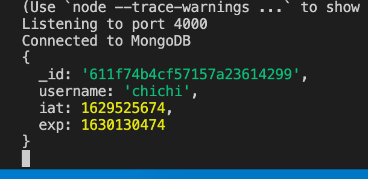
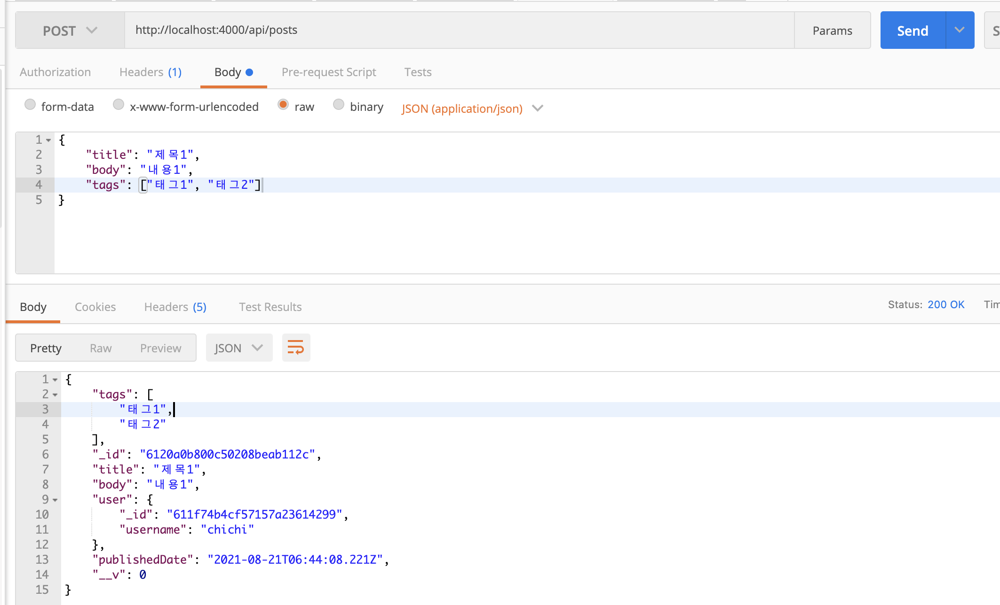
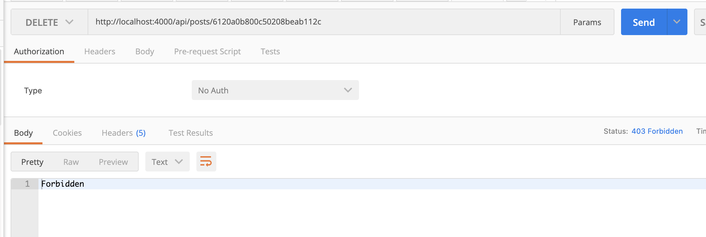
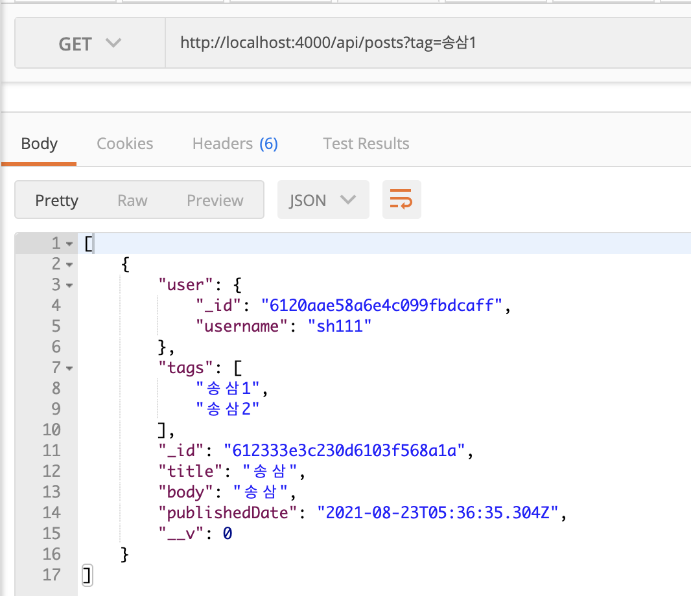

# ReactJS-23 JWT를 통한 회원 인증 시스템 구현


## 🔥1. JWT의 이해

- JSON Web Token 의 약자
- 데이터가 JSON으로 이루어져 있는 토큰을 의미한다.
- 두 개체가 서로 안전하게 정보를 주고 받을 수 있도록 웹 표준으로 정의된 기술


### 1-1) 세션 기반 인증과 토큰 기반 인증의 차이

1. 세션 기반 인증 시스템

   - 서버가 사용자가 로그인 중임을 기억하고 있는 것이다.
   - 사용자가 로그인을 하면, 서버는 세션 저장소에 사용자의 정보를 조회하고 세션 id를 발급한다.
   - 발급된 id는 주로 브라우저의 쿠키에 저장한다.
   - 사용자가 다른 요청을 보낼 때마다 서버는 세션 저장소에 세션을 조회한 후 로그인 여부를 결정하여 작업을 처리하고 응답한다.
   - 세션 저장소는 주로 메모리, 디스크, 데이터베이스 등을 사용한다.
   - 세션 기반 인증의 단점은 서버를 확장하기가 번거롭다. 만약 서버의 인스턴스가 여러개라면, 모든 서버끼리 같은 세션을 공유해야 하므로 세션 전용 데이터베이스를 만들어야하고 그 외에도 신경쓸 것이 많다.
   - 

   

2. 토큰 기반 인증 시스템

   - 토큰은 로그인 이후 서버가 만들어 주는 문자열이다.
   - 문자열 안에는 사용자의 로그인 정보가 들어 있고, 해당 정보가 서버에서 발급되었음을 중명하는 서명이 들어있다.
   - 서명 데이터는 해싱 알고리즘을 통해 만들어지는데, 주로 HMAC, SHA256, RSA SHA256 알고리즘이 사용된다.
   - 서버에서 만들어 준 토큰은 서명이 있기 때문에 무결성이 보장된다.
     - 무결성이란 정보가 변경되거나 위조되지 않았음을 의미하는 성질이다.
   - 사용자가 로그인을 하면 서버에서 사용자에게 해당 사용자의 정보를 지니고 있는 토큰을 발급해 주고, 추후 사용자가 다른 API를 요청하게될 때 발급받은 토큰과 함께 요청한다.
   - 서버는 해당 토큰이 유효한지 검사하고, 결과에 따라 작업을 처리한다.
   - 토큰 기반 인증 시스템의 장점은 서버에서 사용자 로그인 정보를 기억하기 위해 사용하는 리소스가 적다는 것이다.
     - 서버의 확장성이 높고, 서버의 인스턴스가 여러개 늘어나도 서버끼리 사용자의 로그인 상태를 공유하고 있을 필요가 없다.

   

   


## 🔥2. User 스키마/모델 만들기

- User 스키마와 모델을 작성하고 MongoDB에 저장해본다.
- 비밀번호를 데이터베이스에 저장할 때 플레인 텍스트로 저장하면 보안상 매우 위험하기 때문에 단방향 해싱 함수를 지원해주는 bcrypt 라는 라이브러리를 사용한다.

```bash
$ yarn add bcrypt
```

```javascript
// src/models/user.js
import mongoose, { Schema } from 'mongoose';

const UserSchema = new Schema({
  username: String,
  hashedPassword: String,
});

const User = mongoose.model('User', UserSchema);
export default User;
```


### 2-1) 모델 메서드 만들기

- 모델에서 사용할 수 있는 함수를 의미한다.

- 두 가지 종류가 있다.

  - 첫번째는 인스턴스 메서드, 모델을 통해 만든 문서 인스턴스에서 사용할 수 있는 함수를 의미

  - ```javascript
    // 예시 코드
    const user = new User({ username: 'chichi'});
    user.setPassword('mypass123');
    ```

  - 두번째는 스태틱 메서드, 모델에서 바로 사용할 수 있는 함수를 의미

  - ```javascript
    // 예시 코드
    const user = User.findByUsername('chichi');
    ```


### 2-2) 인스턴스 메서드 만들기

- `setPassword`: 비밀번호를 파라미터로 받아서 계정의 hashedPassword 값을 설정해준다.
- `checkPassword`: 파라미터로 받은 비밀번호가 해당 계정의 비밀번호와 일치하는지 검증해준다.

```javascript
// src/models/user.js
(...)
import bcrypt from 'bcrypt';

(...)

UserSchema.methods.setPassword = async function (password) {
  const hash = await bcrypt.hash(password, 10);
  this.hashedPassword = hash;
};

UserSchema.methods.checkPassword = async function (password) {
  const result = await bcrypt.compare(password, this.hashedPassword);
  return result; // true / false
};

(...)
```

- 인스턴스 메서드를 작성할 때는 **화살표 함수가 아닌 function 키워드를 사용**하여 구현해야 한다.
  - 함수 내부에서 `this`에 접근해야 하기 때문이다.
  - 여기서 `this`는 문서 인스턴스를 가리킨다.
  - 화살표 함수를 사용하면 `this`는 문서 인스턴스를 가리키지 못하게 된다.


### 2-3) 스태틱 메서드 만들기

- `findByUsername`: username으로 데이터를 찾을 수 있게 한다.

```javascript
// src/models/user.js
(...)
UserSchema.statics.findByUsername = function (username) {
  return this.findOne({ username });
};
(...)
```

- 스태틱 함수에서의 this는 모델을 가리킨다. 여기서는 User를 가리킨다.


## 🔥3. 회원 인증 API 만들기

```javascript
// src/api/auth/index.js
import Router from 'koa-router';
import * as authCtrl from './auth.ctrl';

const auth = new Router();

auth.post('/register', authCtrl.register);
auth.post('/login', authCtrl.login);
auth.get('/check', authCtrl.check);
auth.post('/logout', authCtrl.logout);

export default auth;
```

```javascript
// src/api/index.js
(...)
import auth from './auth';

(...)
api.user('/auth', auth.routes());
```


### 3-1) 회원가입 구현하기

```javascript
// src/models/user.js
(...)

UserSchema.methods.serialize = function () {
  const data = this.toJSON();
  delete data.hashedPassword;
  return data;
};

(...)
```

```javascript
// src/api.auth/auth.ctrl.js
import Joi from 'joi';
import User from '../../models/user';

/*
    POST /api/auth/register
    {
        username: 'velopert',
        password: 'mypass123'
    }
*/

export const register = async (ctx) => {
  // 회원가입
  // Request Body 검증하기
  const schema = Joi.object().keys({
    username: Joi.string().alphanum().min(3).max(20).required(),
    password: Joi.string().required(),
  });
  const result = schema.validate(ctx.request.body);
  if (result.error) {
    ctx.status = 400;
    ctx.body = result.error;
    return;
  }

  const { username, password } = ctx.request.body;
  try {
    // username이 이미 존재하는지 확인
    const exist = await User.findByUsername(username);
    if (exist) {
      ctx.status = 409; // Conflict
      return;
    }
    const user = new User({
      username,
    });
    await user.setPassword(password); // 비밀번호 설정
    await user.save(); // 데이터베이스에 저장

    // 응답할 데이터에서 hashedPassword 필드 제거
    ctx.body = user.serialize();
  } catch (e) {
    ctx.throw(500, e);
  }
};
```


### 3-2) 로그인 구현하기

```javascript
/*
  POST /api/auth/login
  {
    username: 'chichi',
    password: 'mypass123'
  }
*/
export const login = async (ctx) => {
  // 로그인
  const { username, password } = ctx.request.body;

  // username, password 가 없으면 에러 처리
  if (!username || !password) {
    ctx.status = 401; // Unauthorized
    return;
  }

  try {
    const user = await User.findByUsername(username);
    // 계정이 존재하지 않으면 에러 처리
    if (!user) {
      ctx.status = 401;
      return;
    }
    const valid = await user.checkPassword(password);
    // 잘못된 비밀번호
    if (!valid) {
      ctx.status = 401;
      return;
    }
    ctx.body = user.serialize();
  } catch (e) {
    ctx.throw(500, e);
  }
};
```


## 🔥4. 토큰 발급 및 검증하기

- 클라이언트에서 사용자 로그인 정보를 지니고 있을 수 있도록 서버에서 토큰을 발급해준다.

- jwt토큰을 만들기 위해 jsonwebtoken 이라는 모듈을 설치한다.

```bash
$ yarn add jsonwebtoken
```


### 4-1) 비밀키 설정하기

- .env 파일을 열어서 JWT 토큰을 만들 때 사용할 비밀키를 만든다.

```bash
$ openssl rand -hex 64
b822396384fcb981691e551724cba147ea4814c70b5b04922b046973b4c61b6a83dc025acabca3108e2ee80f61aaf88253e57ce3fb5a75c4571bddc9ee25ead8
```

- 출력된 랜덤 문자열을 복사하여 .env 파일에 JWT_SCRET 값으로 설정한다.

```tex
# .env
PORT=4000
MONGO_URI=mongodb://localhost:27017/blog
JWT_SECRET=b822396384fcb981691e551724cba147ea4814c70b5b04922b046973b4c61b6a83dc025acabca3108e2ee80f61aaf88253e57ce3fb5a75c4571bddc9ee25ead8
```

- 이 비밀키는 나중에 JWT 토큰의 서명을 만드는 과정에서 사용된다. 외부에 공개되면 안된다.


### 4-2) 토큰 발급하기

```javascript
// src/models/user.js
(...)

UserSchema.methods.generateToken = function () {
  const token = jwt.sign(
    // 첫번째 파라미터에는 토큰 안에 집어 넣고 싶은 데이터를 넣는다.
    {
      _id: this.id,
      username: this.username,
    },
    process.env.JWT_SECRET, // 두 번째 파라미터에는 JWT 암호를 넣는다.
    {
      expiresIn: '7d', // 7일 동안 유효함
    },
  );
  return token;
};
```

- 회원가입과 로그인에 성공했을 때 토큰을 사용자에게 전달해준다.
- 사용자가 브라우저에서 토큰을 사용할 때 두가지 방법을 사용한다.
  - 브라우저의 localStorage 혹은 sessionStorage에 담아서 사용
  - 브라우저의 쿠키에 담아서 사용
- 브라우저의 localStorage 혹은 sessionStorage에 토큰을 담으면 사용하기가 매우 편리하고 구현하기도 쉽다.
  - 하지만 누군가가 페이지에 악성 스크립트를 삽입한다면 쉽게 토큰을 탈취할 수 있다.(XSS - Cross Site Scripting)
- 쿠키에 담아도 같은 문제가 발생할 수 있지만, httpOnly 라는 속성을 활성화하면 자바스크립트를 통해 쿠키를 조회할 수 없으므로 악성 스크립트로부터 안전하다.
  - 대신에 CSRF(Cross Site Request Forgery)라는 공격에 취야해질 수 있다.
  - 이 공격은 토큰을 쿠키에 담으면 사용자가 서버로 요청을 할 때마다 무조건 토큰이 함께 전달되는 점을 이용해서 사용자가 모르게 원하지 않는 API 요청을 하게 만든다.
- 단, CSRF는 CSRF 토큰 사용 및 Refere 검증 등의 방식으로 제대로 막을 수 있는 반면, XSS는 보안장치를 적용해 놓아도 개발자가 놓칠 수 있는 다양한 취약점을 통해 공격을 받을 수 있다.
- 여기서는 사용자 토큰을 쿠키에 담아서 사용하겠다.

```javascript
// src/api/auth/auth.ctrl.js

/*
    POST /api/auth/register
    {
        username: 'velopert',
        password: 'mypass123'
    }
*/

export const register = async (ctx) => {
  	(...)
    ctx.body = user.serialize();

    const token = user.generateToken();
    ctx.cookies.set('access_token', token, {
      maxAge: 1000 * 60 * 60 * 24 * 7, // 7일
      httpOnly: true,
    });
  } catch (e) {
    ctx.throw(500, e);
  }
};

/*
  POST /api/auth/login
  {
    username: 'chichi',
    password: 'mypass123'
  }
*/
export const login = async (ctx) => {
  	(...)
    ctx.body = user.serialize();
    const token = user.generateToken();
    ctx.cookies.set('access_token', token, {
      maxAge: 1000 * 60 * 60 * 24 * 7, // 7일
      httpOnly: true,
    });
  } catch (e) {
    ctx.throw(500, e);
  }
};
```


### 4-3) 토큰 검증하기

- 토큰 검증하는 작업을 미들웨어를 통해 처리하도록 만든다.

```javascript
// src/lib/jwtMiddleware.js
import jwt from 'jsonwebtoken';

const jwtMiddleware = (ctx, next) => {
  const token = ctx.cookies.get('access_token');
  if (!token) return next(); // 토큰이 없음
  try {
    const decoded = jwt.verify(token, process.env.JWT_SECRET);
    console.log(decoded);
    return next();
  } catch (e) {
    // 토큰 검증 실패
    return next();
  }
};

export default jwtMiddleware;
```

- 미들웨어를 만든 뒤 main.js 에서 app에 미들웨어를 적용한다.

```javascript
// src/main.js
(...)
import api from './api';
// import createFakeData from './createFakeData';
import jwtMiddleware from './lib/jwtMiddleware';
(...)

// 라우터 설정
router.use('/api', api.routes()); // api 라우트 적용

// 라우터 적용 전에 bodyParser 적용
app.use(bodyParser());
app.use(jwtMiddleware);

(...)
});
```

- 미들웨어를 적용한 뒤 Postman 으로 localhost:4000/api/auth/check 경로에 GET 요청을 해보면 터미널에 토큰이 해석된 결과가 나타난다.



- 이렇게 해석된 결과를 미들웨어에서 사용할 수 있기 위해 ctx의 state 안에 넣어준다.

```javascript
// src/lib/jwtMiddleware.js
(...)
const jwtMiddleware = (ctx, next) => {
  (...)
  try {
    const decoded = jwt.verify(token, process.env.JWT_SECRET);
    ctx.state.user = {
      _id: decoded._id,
      username: decoded.username,
    };
    console.log(decoded);
    return next();
  } catch (e) {
    (...)
  }
};
```

```javascript
// src/api/auth/auth.ctrl.js

/*
  GET /api/auth/check
*/
export const check = async (ctx) => {
  // 로그인 상태 확인
  const { user } = ctx.state;
  if (!user) {
    // 로그인 중 아님
    ctx.status = 401; // Unauthorized
    return;
  }
  ctx.body = user;
};
```


### 4-4) 토큰 재발급하기

- 토큰이 담고 있는 값중 iat 값과 exp 값이 있다.
  - iat: 이 토큰이 언제 만들어졌는지 알려 주는 값
  - exp: 언제 만료되는지 알려 주는 값
- exp에 표현된 날짜가 3.5일 미만이라면 토큰을 새로운 토큰으로 재발급해주는 기능을 구현해보자.

```javascript
// src/lib/jwtMiddleware.js
(...)

const jwtMiddleware = async (ctx, next) => {
  (...)
  try {
    (...)
    // 토큰의 남은 유효 기간이 3.5일 미만이라면 재발급
    const now = Math.floor(Date.now() / 1000);
    if (decoded.exp - now < 60 * 60 * 24 * 3.5) {
      const user = await User.findById(decoded._id);
      const token = user.generateToken();
      ctx.cookies.set('access_token', token, {
        maxAge: 1000 * 60 * 60 * 24 * 7, // 7일
        httpOnly: true,
      });
    }
    console.log(decoded);
    return next();
  } catch (e) {
    // 토큰 검증 실패
    return next();
  }
};
```


### 4-5) 로그아웃 기능 구현하기

- 쿠키를 지워주면 끝난다.

```javascript
// src/api/auth/auth.ctrl.js

/*
  POST /api/auth/logout
*/
export const logout = async (ctx) => {
  // 로그아웃
  ctx.cookies.set('access_token');
  ctx.status = 204; // No Content
};
```


## 🔥5. Posts API에 회원 인증 시스템 도입하기

- 새 포스트는 로그인 해야만 작성할 수 있고, 삭제와 수정은 작성자만 할 수 있도록 구현해보자.


### 5-1) 스키마 수정하기

```javascript
// src/models/post.js
(...)

const PostSchema = new Schema({
  title: String,
  body: String,
  tags: [String], // 문자열로 이루어진 배열
  publishedDate: {
    type: Date,
    default: Date.now, // 현재 날짜를 기본값으로 지정
  },
  user: {
    _id: mongoose.Types.ObjectId,
    username: String,
  },
});

const Post = mongoose.model('Post', PostSchema);
export default Post;
```


### 5-2) posts 컬렉션 비우기

- Compass를 열어서 posts 컬렉션을 삭제


### 5-3) 로그인했을 때만 API를 사용할 수 있게 하기

- 로그인 상태가 아니면 401 HTTP Status를 반환하고, 그렇지 않으면 그다음 미들웨어를 실행

```javascript
// src/lib/checkLoggedIn.js
const checkLoggedIn = (ctx, next) => {
  if (!ctx.state.user) {
    ctx.status = 401; // Unauthorized
    return;
  }
  return next();
};

export default checkLoggedIn;
```

```javascript
// src/api/posts/index.js
(...)
import checkLoggedIn from '../../lib/checkLoggedIn';

(...)
posts.post('/', checkLoggedIn, postsCtrl.write);

(...)
post.delete('/', checkLoggedIn, postsCtrl.remove);
post.patch('/', checkLoggedIn, postsCtrl.update);
(...)
```


### 5-4) 포스트 작성 시 사용자 정보 넣기

- 포스트를 작성할 때 사용자 정보를 넣어서 데이터베이스에 저장

```javascript
// src/api/posts/posts/ctrl.js

/*
  POST /api/posts
  {
    title: '제목',
    body: '내용',
    tags: ['태그1', '태그2']
  }
*/
export const write = async (ctx) => {
  (...)
  const post = new Post({
    title,
    body,
    tags,
    user: ctx.state.user,
  });
  (...)
};
```




### 5-5) 포스트 수정 및 삭제 시 권한 확인하기

- 작성자만 포스트를 수정하거나 삭제할 수 있도록 구현
- id로 포스트를 조회하는 작업을 미들웨어로 해준다.
- 기존의 checkObjectId 를 getPostById 로 바꿔준다.

```javascript
// src/api/posts/posts.ctrl.js
import Post from '../../models/post';
import mongoose from 'mongoose';
import Joi from 'joi';

const { ObjectId } = mongoose.Types;

// 기존 checkObjectId
export const getPostById = async (ctx, next) => {
  const { id } = ctx.params;
  if (!ObjectId.isValid(id)) {
    ctx.status = 400; // Bad Request
    return;
  }
  try {
    const post = await Post.findById(id);
    // 포스트가 존재하지 않을때
    if (!post) {
      ctx.status = 404; // Not Found
      return;
    }
    ctx.state.post = post;
    return next();
  } catch (e) {
    ctx.throw(500, e);
  }
};
```

```javascript
// src/api/posts/index.js
(...)
posts.use('/:id', postsCtrl.getPostById, post.routes());

export default posts;
```

- read함수 내부에서 id로 포스트를 찾는 코드를 간소화해준다.

```javascript
// src/api/posts/posts.ctrl.js
/*
  GET /api/posts/:id
*/
export const read = (ctx) => {
  ctx.body = ctx.state.post;
};
```

- checkOwnPost 라는 미들웨어 작성
  - id로 찾은 포스트가 로그인 중인 사용자가 작성한 포스트인지 확인하는 작업

```javascript
// src/api/posts/posts.ctrl.js

export const checkOwnPost = (ctx, next) => {
  const { user, post } = ctx.state;
  if (post.user._id.toString() !== user._id) {
    ctx.status = 403;
    return;
  }
  return next();
};
```

```javascript
// src/api/posts/index.js

post.delete('/', checkLoggedIn, postsCtrl.checkOwnPost, postsCtrl.remove);
post.patch('/', checkLoggedIn, postsCtrl.checkOwnPost, postsCtrl.update);
```

- 새로운 계정을 만든 다음, 다른 계정을 사용하여 다른 계정으로 작성된 포스트를 삭제해보면 403 Forbidden 이 리턴되는 걸 확인할 수 있다.




## 🔥6. username/tags 로 포스트 필터링하기

- 특정 사용자가 작성한 포스트만 조회하거나 특정 태그만 있는 포스트만 조회하는 기능을 만들어보자.

```javascript
// src/api/posts/posts.ctrl.js
/*
  GET /api/posts?username=&tag=&page=
*/
export const list = async (ctx) => {
  // query는 문자열이기 때문에 숫자로 변환해줘야한다.
  // 값이 주어지지 않는다면 1을 기본으로 사용한다.
  const page = parseInt(ctx.query.page || '1', 10);

  if (page < 1) {
    ctx.status = 400;
    return;
  }

  const { tag, username } = ctx.query;
  // tag, username 값이 유효하면 객체 안에 넣고, 그렇지 않으면 넣지 않음
  const query = {
    ...(username ? { 'user.username': username } : {}),
    ...(tag ? { tags: tag } : {}),
  };

  try {
    const posts = await Post.find(query)
      .sort({ _id: -1 })
      .limit(10)
      .skip((page - 1) * 10)
      .exec();
    const postCount = await Post.countDocuments(query).exec();
    ctx.set('Last-Page', Math.ceil(postCount / 10));
    ctx.body = posts
      .map((post) => post.toJSON())
      .map((post) => ({
        ...post,
        body:
          post.body.length < 200 ? post.body : `${post.body.slice(0, 200)}...`,
      }));
  } catch (e) {
    ctx.throw(500, e);
  }
};
```

- username 혹은 tag 값이 유효할 때만 객체 안에 해당 값을 넣는다.
- 다음과 같이 요청을 하면 해당 쿼리에 대응하는 값들이 출력된다.

```bash
GET http://localhost:4000/api/posts?username=chichi
GET http://localhost:4000/api/posts?tag=태그
```


