# ReactJS-24 프론트엔드 프로젝트: 시작 및 회원 인증 구현


## 🔥1. 작업 환경 준비하기

- blog 디렉토리에 생성

```bash
$ yarn create react-app blog-frontend
```


### 1-1) 설정 파일 만들기

- Prettier 설정

```javascript
// .prettierrc
{
  "singleQuote": true,
  "semi": true,
  "useTabs": false,
  "tabWidth": 2,
  "trailingComma": "all",
  "printWidth": 80
}
```

- 프로젝트에서 자동 import 기능이 제대로 작동할 수 있게 설정

```javascript
// jsconfig.json
{
  "compilerOptions": {
    "target": "es6"
  }
}
```


### 1-2) 라우터 적용

```bash
$ yarn add react-router-dom
```

- 라우트와 관련된 컴포넌트들은 src/pages 디렉터리에 만든다.
  - LoginPage.js - 로그인
  - RegisterPage.js - 회원가입
  - WritePage.js - 글쓰기
  - PostPage.js - 포스트 읽기
  - PostListPage.js - 포스크 목록

```react
// src/pages/LoginPage.js
import React from 'react';

const LoginPage = () => {
  return <div>로그인</div>;
};

export default LoginPage;
```

```react
// src/pages/RegisterPage.js
import React from 'react';

const RegisterPage = () => {
  return <div>회원가입</div>;
};

export default RegisterPage;
```

```react
// src/pages/WritePage.js
import React from 'react';

const WritePage = () => {
  return <div>글쓰기</div>;
};

export default WritePage;
```

```react
// src/pages/PostPage.js
import React from 'react';

const PostPage = () => {
  return <div>포스트 읽기</div>;
};

export default PostPage;
```

```react
// src/pages/PostListPage.js
import React from 'react';

const PostListPage = () => {
  return <div>포스트 리스트</div>;
};

export default PostListPage;
```

- 프로젝트 엔트리 파일인 index.js 에서 BrowserRouter로 App 컴포넌트를 감싼다.

```react
// src/index.js
import React from 'react';
import ReactDOM from 'react-dom';
import './index.css';
import App from './App';
import { BrowserRouter } from 'react-router-dom';

ReactDOM.render(
  <BrowserRouter>
    <App />
  </BrowserRouter>,
  document.getElementById('root'),
);
```

- Route 컴포넌트를 사용하여 각 라우트의 경로를 지정

```react
// src/App.js
import React from 'react';
import { Route } from 'react-router-dom';
import PostListPage from './pages/PostListPage';
import LoginPage from './pages/LoginPage';
import RegisterPage from './pages/RegisterPage';
import WritePage from './pages/WritePage';
import PostPage from './pages/PostPage';

const App = () => {
  return (
    <>
      <Route component={PostListPage} path={['/@:username', '/']} exact />
      <Route component={LoginPage} path="/login" />
      <Route component={RegisterPage} path="/register" />
      <Route component={WritePage} path="/write" />
      <Route component={PostPage} path="/@:username/:postId" />
    </>
  );
};

export default App;
```


### 1-3) 스타일 설정

- styled-components 를 사용하여 스타일링한다.

```bash
$ yarn add styled-components
```

```react
// src/lib/styles/palette.js
// source: https://yeun.github.io/open-color/
const palette = {
  gray: [
    '#f8f9fa',
    '#f1f3f5',
    '#e9ecef',
    '#dee2e6',
    '#ced4da',
    '#adb5bd',
    '#868e96',
    '#495057',
    '#343a40',
    '#212529',
  ],
  cyan: [
    '#e3fafc',
    '#c5f6fa',
    '#99e9f2',
    '#66d9e8',
    '#3bc9db',
    '#22b8cf',
    '#15aabf',
    '#1098ad',
    '#0c8599',
    '#0b7285',
  ],
};

export default palette;
```


### 1-4) Button 컴포넌트 만들기

- 이 버튼 컴포넌트는 다양한 곳에서 재사용할 예정이다.
- 아래 코드에서 굳이 Button 리액트 컴포넌트를 만들어서 그 안에 StyledButton을 렌더링해 준 이유는 추후 이 컴포넌트를 사용할 때 자동 import가 되게 하기 위해서이다.
- styled-components로 만든 컴포넌트를 바로 내보내면 자동 import가 되지 않는다.
- Button 컴포넌트를 만드는 과정에서 {...props}를 StyledButton에 설정해 주었는데 이는 Button이 받아오는 props를 모두 StyledButton에 전달한다는 의미이다.

```react
// src/components/common/Button.js
import React from 'react';
import styled from 'styled-components';
import palette from '../../lib/styles/palette';

const StyledButton = styled.button`
  border: none;
  border-radius: 4px;
  font-size: 1rem;
  font-weight: bold;
  padding: 0.25rem 1rem;
  color: white;
  outline: none;
  cursor: pointer;

  background: ${palette.gray[8]};
  &:hover {
    background: ${palette.gray[6]};
  }
`;

const Button = (props) => <StyledButton {...props} />;

export default Button;
```

- 버튼 컴포넌트를 만들었으면 PostListPage 컴포넌트에 렌더링 해보자.

```react
// src/pages/PostListPage.js
import React from 'react';
import Button from '../components/common/Button';

const PostListPage = () => {
  return (
    <div>
      <Button>버튼</Button>
    </div>
  );
};

export default PostListPage;
```

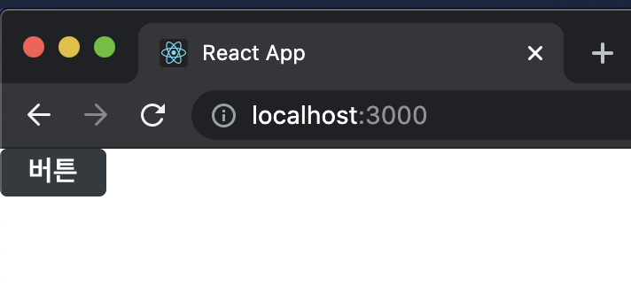

- 프로젝트의 글로벌 스타일도 수정해준다.

```react
// src/index.css
body {
  margin: 0;
  font-family: -apple-system, BlinkMacSystemFont, 'Segoe UI', 'Roboto', 'Oxygen',
    'Ubuntu', 'Cantarell', 'Fira Sans', 'Droid Sans', 'Helvetica Neue',
    sans-serif;
  -webkit-font-smoothing: antialiased;
  -moz-osx-font-smoothing: grayscale;
  box-sizing: border-box; /* 엘리먼트의 box-sizing 값을 border-box로 설정 */
  min-height: 100%;
}

#root {
  min-height: 100%;
}

/*
추후 회원 인증 페이지에서 배경화면을 페이지의 전체영역에 채우기 위한 용도
*/
html {
  height: 100%;
}

/* 링크의 색상 및 밑줄 없애기 */
a {
  color: inherit;
  text-decoration: none;
}

* {
  box-sizing: inherit; /* 모든 엘리먼트의 box-sizing 값을 border-box로 설정 */
}

code {
  font-family: source-code-pro, Menlo, Monaco, Consolas, 'Courier New',
    monospace;
}
```


### 1-5) 리덕스 적용

- 비동기 작업을 관리하는 과정에서 redux-saga 를 쓸 예정이고, 지금은 리덕스 스토어를 생성하고 Provider 컴포넌트를 통해 프로젝트에 리덕스를 적용하는 과정만 한다.

```bash
$ yarn add redux react-redux redux-actions immer redux-devtools-extension
```

```react
// src/modules/auth.js
import { createAction, handleActions } from 'redux-actions';

const SAMPLE_ACTION = 'auth/SAMPLE_ACTION';

export const sampleAction = createAction(SAMPLE_ACTION);

const initialState = {};

const auth = handleActions(
  {
    [SAMPLE_ACTION]: (state, action) => state,
  },
  initialState,
);

export default auth;
```

```react
// src/modules/index.js
import { combineReducers } from 'redux';
import auth from './auth';

const rootReducer = combineReducers({
  auth,
});

export default rootReducer;
```

```react
// src/index.js
(...)
import { Provider } from 'react-redux';
import { createStore } from 'redux';
import { composeWithDevTools } from 'redux-devtools-extension';
import rootReducer from './modules';

const store = createStore(rootReducer, composeWithDevTools());

ReactDOM.render(
  <Provider store={store}>
    <BrowserRouter>
      <App />
    </BrowserRouter>
  </Provider>,
  document.getElementById('root'),
);
```

- 크롬 개발자 도구를 Redux 탭을 보면 auth 객체가 존재하는 것을 볼 수 있다.

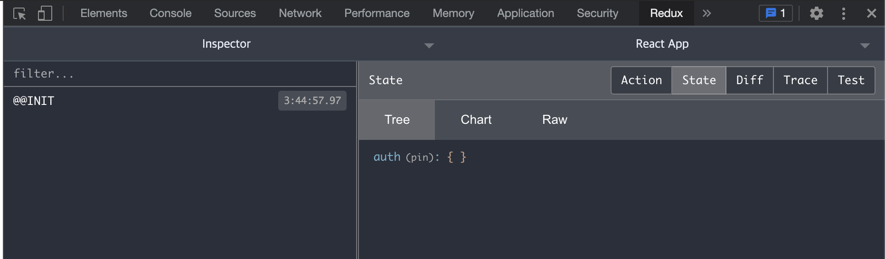


## 🔥2. 회원가입과 로그인 구현

### 2-1) UI 준비하기

- 프레젠테이셔널 컴포넌트들은 components 디렉터리에 작성한다.
  - common 디렉터리: 재사용되는 컴포넌트
  - auth 디렉터리: 회원 인증에 관련된 컴포넌트
  - write: 글쓰기에 관련된 컴포넌트
  - post: 포스트 읽기에 관련된 컴포넌트

```react
// src/components/auth/AuthForm.js
import React from 'react';
import styled from 'styled-components';

/*
    회원가입 또는 로그인 폼을 보여 준다.
*/
const AuthFormBlock = styled.div``;
const AuthForm = () => {
  return <AuthFormBlock>AuthForm</AuthFormBlock>;
};

export default AuthForm;
```

- 앞으로 컴포넌트 만들 때 styled-components로 스타일링한다.
  - 앞으로 각 컴포넌트의 최상위 컴포넌트를 선언할 때 이름 뒤에 Block이라는 단어를 붙여줄 예정이다.
  - 보통 styled-components를 사용할 때 꼭 Block이 아니어도 Wrapper라는 단어를 붙이거나, 이름 앞에 Styled라는 단어를 붙이다.

```react
// components/auth/AuthTemplate.js
import React from 'react';
import styled from 'styled-components';

/*
    회원가입/로그인 페이지의 레이아웃을 담당하는 컴포넌트이다.
*/

const AuthTemplateBlock = styled.div``;

const AuthTemplate = () => {
  return <AuthTemplateBlock></AuthTemplateBlock>;
};

export default AuthTemplate;
```


---

### 참고) VS Code Snippet 직접 만들어서 사용

- https://snippet-generator.app/
- 위에서 만든 AuthTemplate 코드를 복사하여 좌측 텍스트 코드에 붙여보자.
- AuthTemplate는 모두 ${TM_FILENAME_BASE} 로 대체한다. 이는 확장자를 제외한 파일 이름을 의미한다. 주석도 지운다.

```react
import React from 'react';
import styled from 'styled-components';

const ${TM_FILENAME_BASE}Block = styled.div``;

const ${TM_FILENAME_BASE} = () => {
  return <${TM_FILENAME_BASE}Block></${TM_FILENAME_BASE}Block>;
};

export default ${TM_FILENAME_BASE};
```

- Snippet의 설명과 줄임단어를 아래 화면과 같이 입력한다. 'Styled React Functional', 'srfc'

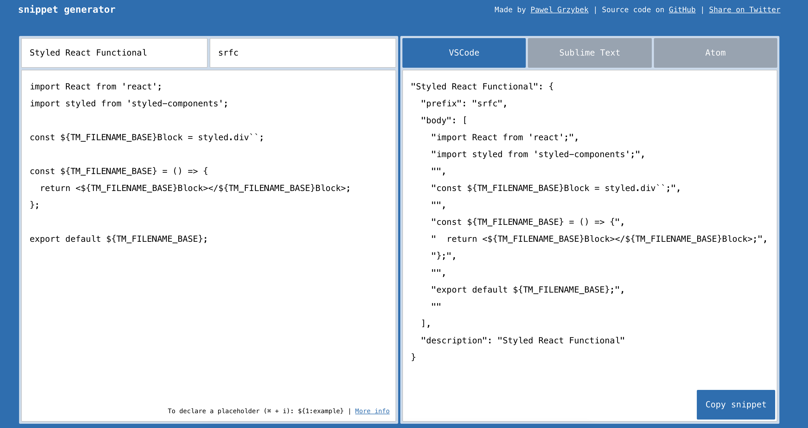

- VS Code의 User Snippets 설정을 누른다.

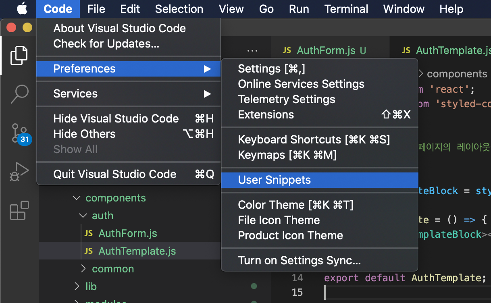

- 어떤 언어의 Snippet을 설정할 지 물어보는데 javascriptreact로 입력하면 된다.

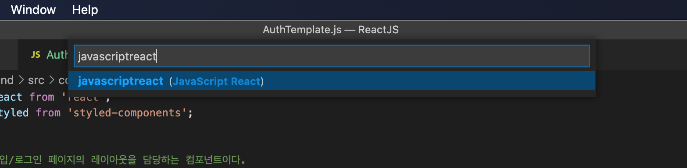

- snippet 사이트에서 변환한 코드를 복사해서 붙여넣는다.

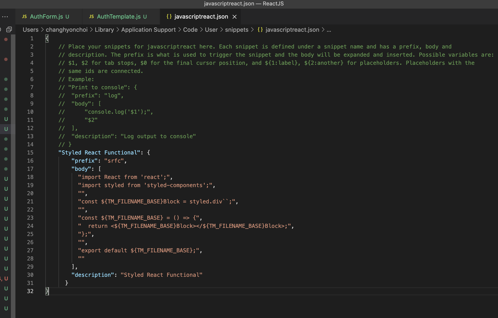

- 이제 제대로 동작하는지 확인하기 위해 src/components/base 경로에 Header 이름으로 컴포넌트 파일을 만든다.

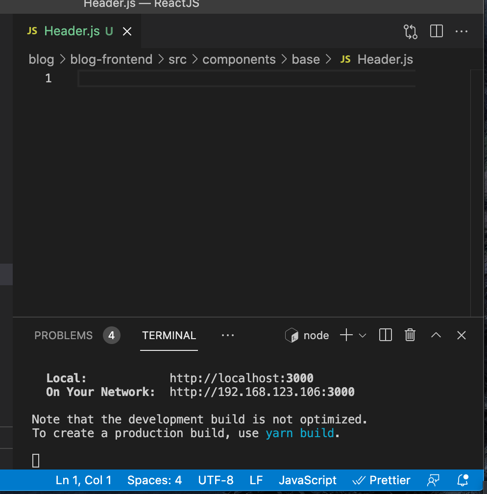

- 오른쪽 하단에 언어가 JavaScript로 나오는데 이러면 방금 만든 Snippet을 사용할 수 없다.
- JavaScript 부분을 클릭하고 Configure File Association for '.js' 에서 JavaScript React 로 바꿔준다.

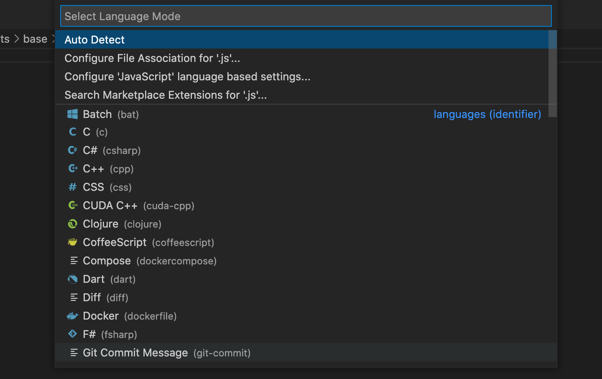

- srfc 라고 입력하면 코드가 자동 생성된다.

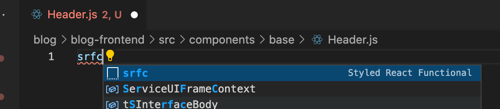

---

- AuthTemplate 컴포넌트를 열어서 children을 렌더링한다.

```react
// src/components/auth/AuthTemplate.js
import React from 'react';
import styled from 'styled-components';

/*
    회원가입/로그인 페이지의 레이아웃을 담당하는 컴포넌트이다.
*/

const AuthTemplateBlock = styled.div``;

const AuthTemplate = ({ children }) => {
  return <AuthTemplateBlock>{children}</AuthTemplateBlock>;
};

export default AuthTemplate;
```

- LoginPage와 RegisterPage 에서 Auth 컴포넌트들을 렌더링해준다.

```react
// src/pages/LoginPage.js
import React from 'react';
import AuthTemplate from '../components/auth/AuthTemplate';
import AuthForm from '../components/auth/AuthForm';

const LoginPage = () => {
  return (
    <AuthTemplate>
      <AuthForm />
    </AuthTemplate>
  );
};

export default LoginPage;
```

```react
// src/pages/RegisterPage.js
import React from 'react';
import AuthTemplate from '../components/auth/AuthTemplate';
import AuthForm from '../components/auth/AuthForm';

const RegisterPage = () => {
  return (
    <AuthTemplate>
      <AuthForm />
    </AuthTemplate>
  );
};

export default RegisterPage;
```

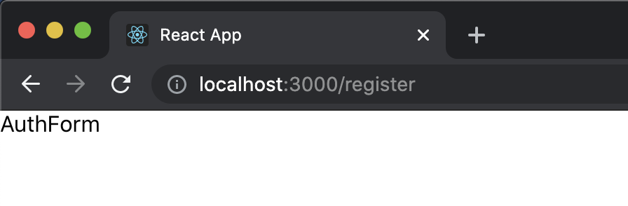


#### 2-1-1) AuthTemplate 완성하기

- AuthTemplate 컴포넌트는 children으로 받아 온 내용을 보여 주기만 하는 역할이다.
- 배경은 회색이고, 중앙에 흰색 박스를 띄어 주고, 홈 경로 /로 돌아가는 링크도 보여준다.

```react
// src/components/auth/AuthTemplate.js
import React from 'react';
import styled from 'styled-components';
import palette from '../../lib/styles/palette';
import { Link } from 'react-router-dom';

/*
    회원가입/로그인 페이지의 레이아웃을 담당하는 컴포넌트이다.
*/

/* 화면 전체를 채움 */
const AuthTemplateBlock = styled.div`
  position: absolute;
  left: 0;
  top: 0;
  bottom: 0;
  right: 0;
  background: ${palette.gray[2]};
  /* flex로 내부 내용 중앙 정렬 */
  display: flex;
  flex-direction: column;
  justify-content: center;
  align-items: center;
`;

/* 흰색 박스 */
const WhiteBox = styled.div`
  .logo-area {
    display: black;
    padding-bottom: 2rem;
    text-align: center;
    font-weight: bold;
    letter-spacing: 2px;
  }
  box-shadow: 0 0 8px rgba(0, 0, 0, 0.025);
  padding: 2rem;
  width: 360px;
  background: white;
  border-radius: 2px;
`;

const AuthTemplate = ({ children }) => {
  return (
    <AuthTemplateBlock>
      <WhiteBox>
        <div className="logo-area">
          <Link to="/">REACTERS</Link>
        </div>
        {children}
      </WhiteBox>
    </AuthTemplateBlock>
  );
};

export default AuthTemplate;
```

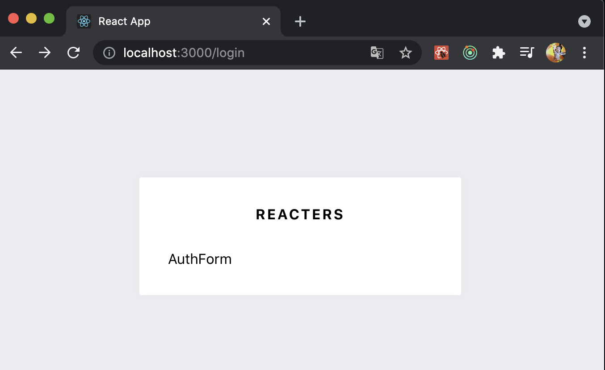


#### 2-1-2) AuthForm 완성하기

```react
// src/components/auth/AuthForm.js
import React from 'react';
import styled from 'styled-components';
import { Link } from 'react-router-dom';
import palette from '../../lib/styles/palette';
import Button from '../common/Button';

/*
    회원가입 또는 로그인 폼을 보여 준다.
*/
const AuthFormBlock = styled.div`
  h3 {
    margin: 0;
    color: ${palette.gray[8]};
    margin-bottom: 1rem;
  }
`;

/*
  스타일링된 input
*/

const StyledInput = styled.input`
  font-size: 1rem;
  border: none;
  border-bottom: 1px solid ${palette.gray[5]};
  padding-bottom: 0.5rem;
  outline: none;
  width: 100%;
  &:focus {
    color: $oc-teal-7;
    border-bottom: 1px solid ${palette.gray[7]};
  }
  & + & {
    margin-top: 1rem;
  }
`;

/*
  폼 하단에 로그인 혹은 회원가입 링크를 보여 줌
*/
const Footer = styled.div`
  margin-top: 2rem;
  text-align: right;
  a {
    color: ${palette.gray[6]};
    text-decoration: underline;
    &:hover {
      color: ${palette.gray[9]};
    }
  }
`;

const AuthForm = () => {
  return (
    <AuthFormBlock>
      <h3>로그인</h3>
      <form>
        <StyledInput
          autoComplete="username"
          name="username"
          placeholder="아이디"
        />
        <StyledInput
          autoComplete="new-password"
          name="password"
          placeholder="비밀번호"
          type="password"
        />
        <Button>로그인</Button>
      </form>
      <Footer>
        <Link to="/register">회원가입</Link>
      </Footer>
    </AuthFormBlock>
  );
};

export default AuthForm;
```

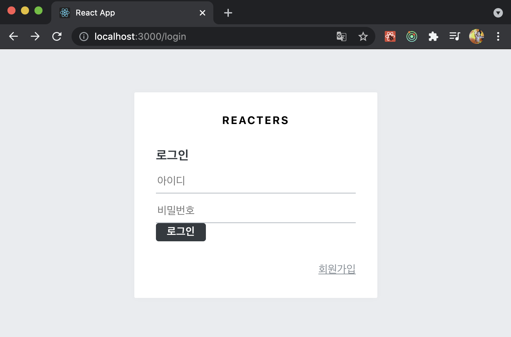


- 여기서 로그인 버튼에 밝은 파란색을 넣어주고 width를 100% 차지하는 것으로 수정해본다.

```react
// src/components/common/Button.js
import React from 'react';
import styled, { css } from 'styled-components';
import palette from '../../lib/styles/palette';

const StyledButton = styled.button`
	(...)

  ${(props) =>
    props.cyan &&
    css`
      background: ${palette.cyan[5]};
      &:hover {
        background: ${palette.cyan[4]};
      }
    `}
`;

const Button = (props) => <StyledButton {...props} />;

export default Button;
```

- 버튼 컴포넌트에 상단 여백을 넣어주고 적용해준다.

```react
// src/components/auth/AuthForm.js
(...)
 
const ButtonWithMarginTop = styled(Button)`
  margin-top: 1rem;
`;

const AuthForm = () => {
  return (
    (...)
        <ButtonWithMarginTop cyan fullWidth>
          로그인
        </ButtonWithMarginTop>
     (...)
  );
};

export default AuthForm;

```

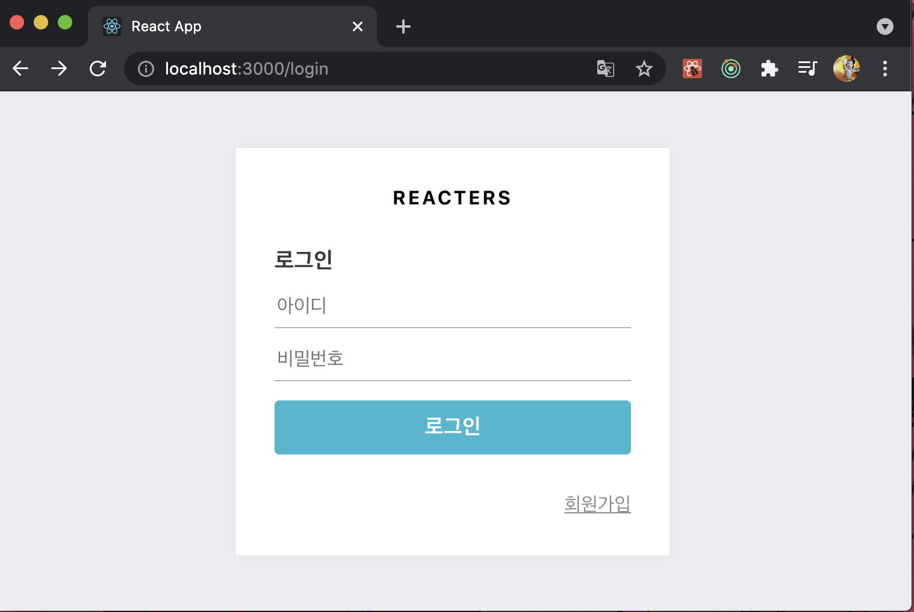


- AuthForm에서 type props에 따라 다른 내용을 보여주도록 수정한다.
- type 값에 따라 사용되는 문구도 달라지고, type이 'register'일 때는 비밀번호 확인 인풋도 보여준다.

```react
// src/components/auth/AuthForm.js
(...)
 
const textMap = {
  login: '로그인',
  register: '회원가입',
};

const AuthForm = ({ type }) => {
  const text = textMap[type];
  return (
    <AuthFormBlock>
      <h3>{text}</h3>
      <form>
        (...)
        {type === 'register' && (
          <StyledInput
            autoComplete="new-password"
            name="passwordConfirm"
            placeholder="비밀번호 확인"
            type="password"
          />
        )}
        <ButtonWithMarginTop cyan fullWidth style={{ marginTop: '1rem' }}>
          {text}
        </ButtonWithMarginTop>
      </form>
      <Footer>
        {type === 'login' ? (
          <Link to="/register">회원가입</Link>
        ) : (
          <Link to="/login">로그인</Link>
        )}
      </Footer>
    </AuthFormBlock>
  );
};

export default AuthForm;
```

```react
// src/pages/LoginPage.js

const LoginPage = () => {
  return (
    <AuthTemplate>
      <AuthForm type="login" />
    </AuthTemplate>
  );
};

export default LoginPage;
```

```react
// src/pages/RegisterPage.js

const RegisterPage = () => {
  return (
    <AuthTemplate>
      <AuthForm type="register" />
    </AuthTemplate>
  );
};

export default RegisterPage;
```

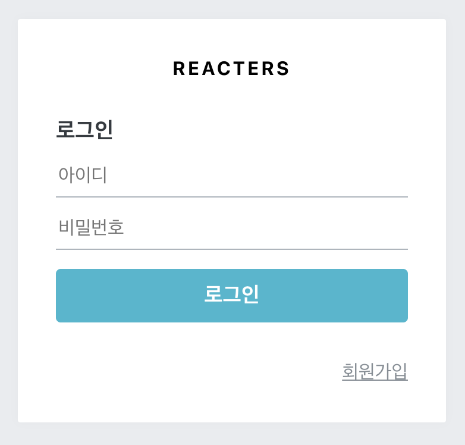

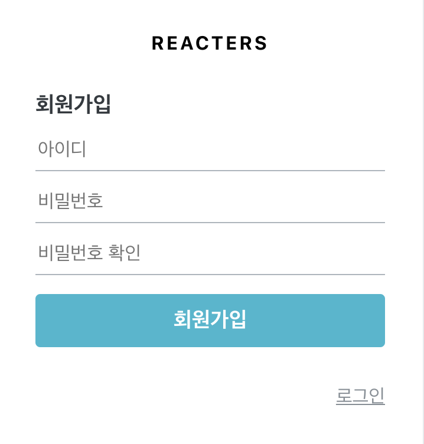


### 2-2) 리덕스로 폼 상태 관리하기

- 리덕스로 회원가입과 로그인 폼의 상태를 관리한다.

```react
// src/modules/auth.js
import { createAction, handleActions } from 'redux-actions';
import produce from 'immer';

const CHANGE_FIELD = 'auth/CHANGE_FIELD';
const INITIALIZE_FORM = 'auth/INITIALIZE_FORM';

export const changeField = createAction(
  CHANGE_FIELD,
  ({ form, key, value }) => ({
    form, // register, login
    key, // username, password, passwordConfirm
    value, // 실제 바꾸려는 값
  }),
);
export const initializeForm = createAction(INITIALIZE_FORM, (form) => form); // register

const initialState = {
  register: {
    username: '',
    password: '',
    passwordConfirm: '',
  },
  login: {
    username: '',
    password: '',
  },
};

const auth = handleActions(
  {
    [CHANGE_FIELD]: (state, { payload: { form, key, value } }) =>
      produce(state, (draft) => {
        draft[form][key] = value;
      }),
    [INITIALIZE_FORM]: (state, { payload: form }) => ({
      ...state,
      [form]: initialState[form],
    }),
  },
  initialState,
);

export default auth;
```

