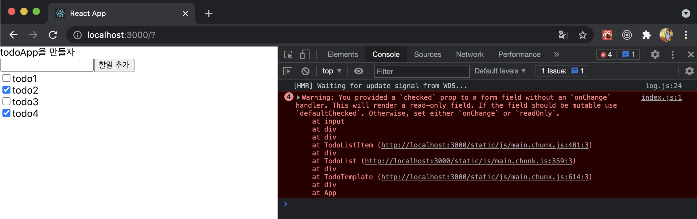

# 혼자서 TODO 리스트 앱 만들기

- 기능: 할일 목록을 조회, 추가, 수정, 삭제


## 1. 리액트

- <TodoListItem> 컴포넌트에서 체크박스 이슈 발생

  - ```bash
    index.js:1 Warning: You provided a `checked` prop to a form field without an `onChange` handler. This will render a read-only field. If the field should be mutable use `defaultChecked`. Otherwise, set either `onChange` or `readOnly`.
    ```

  - 

  - ```react
    // src/component/TodoListItem.js
    import React from 'react';
    
    const TodoListItem = ({data}) => {
        return (
            <div>
                <div>
                    <input type="checkbox" checked={data.checked} />
                    {data.todo}
                </div>
            </div>
        );
    };
    
    export default TodoListItem;
    ```

  - `onChange` 이벤트를 넣어서 해결!

  - ```react
    // src/component/TodoListItem.js
    import React from 'react';
    
    const TodoListItem = ({data, onCheckChange}) => {
        return (
            <div>
                <div>
                    <input type="checkbox" checked={data.checked} onChange={onCheckChange} />
                    {data.todo}
                </div>
            </div>
        );
    };
    
    export default TodoListItem;
    ```

- 자바스크립트 배열 함수(map, concat, filter)


## 2. Context API 사용