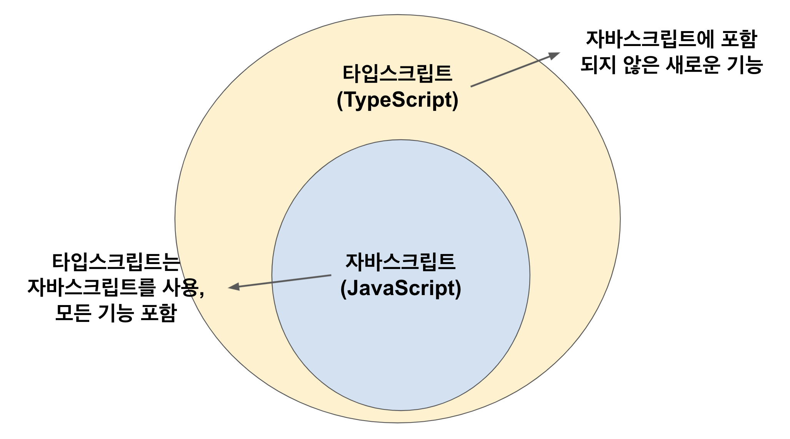

# TypeScript





## 1. 특징

1. 변수값에 데이터 타입 지정 가능
2. 객체 지향적
3. 컴파일 타임 오류
   - 자바스크립트 엔진은 타입스크립트 코드를 이해할 수 없다.
   - 그래서 컴파일(자바스크립트 언어로 변환)을 해야 한다.
   - 컴파일: 어떤 언어의 코드를 다른 언어로 바꿔주는 변환 과정 


## 2. 설치

- npm: Node Package Manger

```bash
$ sudo npm install -g typescript
```


