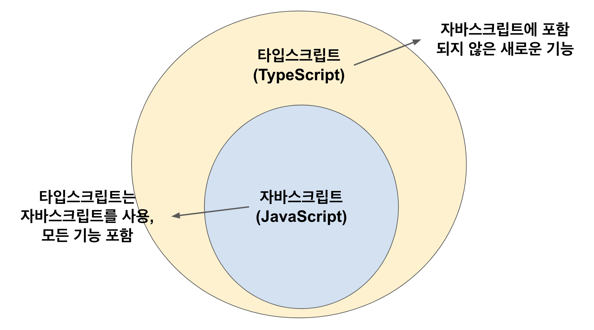

# TypeScript 01 - 설치와 환경설정


- 타입스크립트는 자바스크립트를 기반으로 한 언어이다.
- 자바스크립트에서 유효한 코드는 타입스크립트에서도 유효하다.




## 1. 특징

1. 변수값에 데이터 타입 지정 가능
2. 객체 지향적
3. 컴파일 타임 오류
   - 자바스크립트 엔진은 타입스크립트 코드를 이해할 수 없다.
   - 그래서 컴파일(자바스크립트 언어로 변환)을 해야 한다.
   - 컴파일: 어떤 언어의 코드를 다른 언어로 바꿔주는 변환 과정 


## 2. 설치

- npm: Node Package Manger

```bash
$ sudo npm install -g typescript
```


## 3. 실습

- First-typescript라는 디렉터리를 하나 만들고 그 안에 app.ts 라고 파일명과 확장자명을 입력한다.

```typescript
// app.ts
function logName(name: String) {
  console.log(name);
}

logName("chichi");
```

- 그 다음 타입스크립트를 컴파일 하기 위해 `tsc(=typescript compiler)` 명령어를 입력한다.

```bash
$ tsc app.ts
```

- 그러면 타입스크립트 코드가 자바스크립트 코드로 변환된 app.js 파일이 생성된다.


- 생성된 .js 파일을 실행시켜 본다.

```bash
$ node app.js
```


## 4. VSCode 에러 해결

- 다음과 같이 타입스크립트 코드에 가면 에러 밑줄 표시가 뜬다.


- 이를 해결하기 위해 typescript configuration 파일을 만들어준다.

```bash
$ tsc --init
```

- tsconfig.json 파일을 생성되면서 에러 밑줄이 사라졌다.


## 5. 타입스크립트 자동 컴파일

- 만약에 타입스크립트 코드를 수정한다면 계속해서 컴파일 명령어를 입력해줘야 한다.
- 이런 것을 매번 하기에는 귀찮은 일이기 때문에 타입스크립트 코드가 바뀔때마다 자동으로 컴파일 해주는 명령어를 입력하여 해결한다.

```bash
# w는 watch(감시하다)의 줄임말
$ tsc -w app.ts
```


